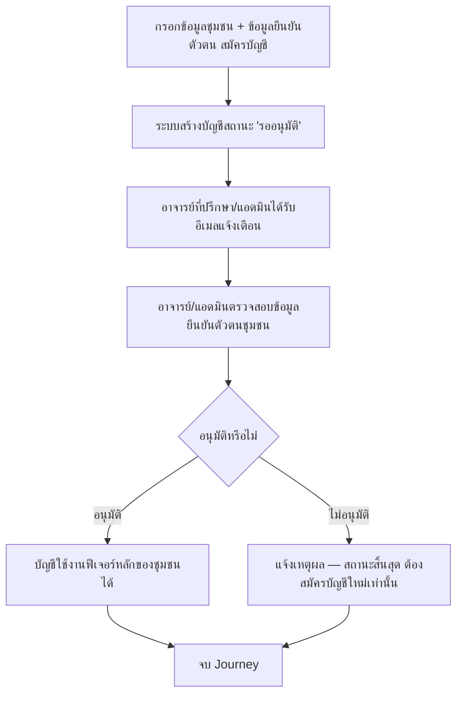

# User Journey: ชุมชน — สมัคร/อนุมัติบัญชีชุมชนใหม่

- **สถานะ**: Confirmed — ไม่มี Open Question ที่กระทบ journey นี้ (ดู [[../../01-requirements/03-task/open-questions|open-questions]])
- **อ้างอิงจาก**: [[../../01-requirements/01-spec/local-story-hub|local-story-hub]] (Business Rules — ตัดสินใจ 2026-09-22)
- **ดู Architecture (conceptual, Data Flow) ที่ใช้ journey นี้ประกอบ**: [[../02-technical/architecture|architecture]] § "สมัคร/อนุมัติบัญชีชุมชนใหม่ (ชุมชน → อาจารย์ที่ปรึกษา/แอดมิน)"
- **ดู ACL (สิทธิ์การเข้าถึง) ที่เกี่ยวข้อง**: [[../02-technical/ACL|ACL]]
- **ดู Prototype ที่แตกจาก journey นี้**: [[prototype-v3/README|prototype-v3]] (`community-register.html`)
- **ดู Test Plan ที่แตกจาก journey นี้**: [[../../03-testing/01-test-plan/test-plan|test-plan]] (TC-017–TC-019)
- **ดู Sequence Diagram ละเอียดที่แตกจาก journey นี้**: [[../02-technical/detailed-design|detailed-design]] § Sequence #8 (เพิ่ม 2026-09-23)

## Diagram

## คำอธิบาย

1. ตัวแทนชุมชนกรอกข้อมูลชุมชน + ข้อมูลยืนยันตัวตน แล้วสมัครบัญชี — Business Rule "การยืนยันตัวตนชุมชนใหม่" [[../../01-requirements/01-spec/local-story-hub|local-story-hub]], BL-022 `(ปิด Open Question แล้ว 2026-09-22 — ใช้ข้อมูลพื้นฐานเท่านั้น: ชื่อผู้ติดต่อ/ผู้นำชุมชน + เบอร์โทร/อีเมล ไม่ต้องแนบเอกสารทางการ)`
2. ระบบสร้างบัญชี `role=community` สถานะ "รออนุมัติ" ทันที — BL-022
3. อาจารย์ที่ปรึกษา/แอดมินได้รับอีเมลแจ้งเตือนว่ามีบัญชีชุมชนใหม่รออนุมัติ — BL-022
4. อาจารย์/แอดมินตรวจสอบข้อมูลยืนยันตัวตนของชุมชน — Business Rule ป้องกันมิจฉาชีพแอบอ้างเป็นไกด์ชุมชน [[../../01-requirements/01-spec/local-story-hub|local-story-hub]]
5. อนุมัติ → บัญชีใช้งานฟีเจอร์หลักได้ตามสิทธิ์ (ดู [[../02-technical/ACL|ACL.md]]) — BL-022
6. ไม่อนุมัติ → ระบบแจ้งเหตุผลกลับไปยังผู้สมัคร เป็นสถานะสิ้นสุด ต้องสมัครบัญชีใหม่เท่านั้น (แก้ไข/ส่งซ้ำบัญชีเดิมไม่ได้ เหมือนกฎของนิสิต) — BL-022
