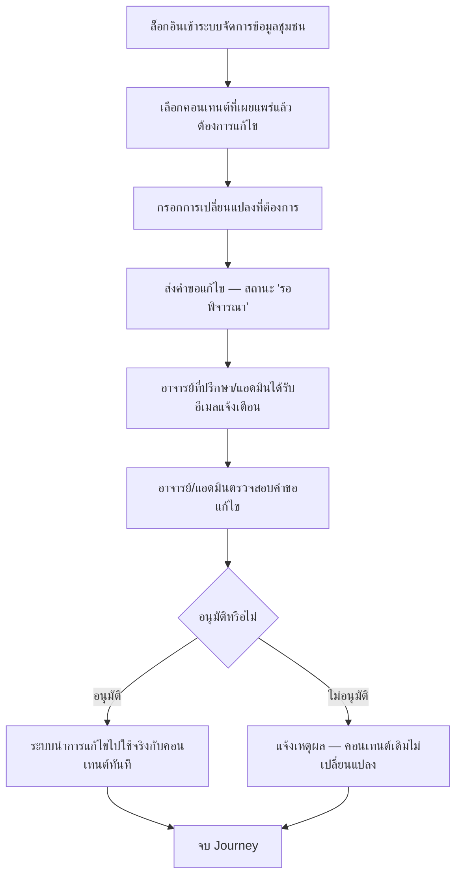

# User Journey: ชุมชน — ขอแก้ไขข้อมูล/คอนเทนต์ (ต้องผ่านอนุมัติ)

- **สถานะ**: Confirmed — ไม่มี Open Question ที่กระทบ journey นี้เลย (ปิดครบรวมถึงข้อสันนิษฐานเดิมเรื่องแก้ไขข้ามชุมชนแล้วเมื่อ 2026-09-22 — ดู [[../../01-requirements/03-task/open-questions|open-questions]])
- **อ้างอิงจาก**: [[../../01-requirements/01-spec/local-story-hub|local-story-hub]] (Business Rules — ตัดสินใจ 2026-09-22)
- **ดู Architecture (conceptual, Data Flow) ที่ใช้ journey นี้ประกอบ**: [[../02-technical/architecture|architecture]] § "ชุมชนขอแก้ไขข้อมูล → อาจารย์ที่ปรึกษา/แอดมินอนุมัติ" (entity `ContentEditRequest`)
- **ดู ACL (สิทธิ์การเข้าถึง) ที่เกี่ยวข้อง**: [[../02-technical/ACL|ACL]]
- **ดู Prototype ที่แตกจาก journey นี้**: [[prototype-v3/README|prototype-v3]] (`community-request-edit.html`, `admin-review-community.html`)
- **ดู Test Plan ที่แตกจาก journey นี้**: [[../../03-testing/01-test-plan/test-plan|test-plan]] (TC-020–TC-022)
- **ดู Sequence Diagram ละเอียดที่แตกจาก journey นี้**: [[../02-technical/detailed-design|detailed-design]] § Sequence #9 (เพิ่ม 2026-09-23)

## Diagram

## คำอธิบาย

1. ตัวแทนชุมชนล็อกอินเข้าระบบจัดการข้อมูลชุมชน — FR-1.6 [[../../01-requirements/01-spec/local-story-hub|local-story-hub]]
2. เลือกคอนเทนต์ของชุมชนตนเองที่เผยแพร่ (published) ไปแล้ว ที่ต้องการแก้ไข — Business Rule "สิทธิ์การเข้าถึงข้อมูลของชุมชน" [[../../01-requirements/01-spec/local-story-hub|local-story-hub]], BL-023 `(ปิด Open Question แล้ว 2026-09-22 — journey นี้ครอบคลุมเฉพาะคอนเทนต์ของชุมชนตนเองเท่านั้น ยืนยันแล้วว่าไม่รองรับการขอแก้ไขคอนเทนต์ของชุมชนอื่น)`
3. กรอกการเปลี่ยนแปลงที่ต้องการ (เช่น เนื้อหา รูปภาพ แคปชัน) — BL-023
4. ส่งคำขอแก้ไข ระบบบันทึกเป็นสถานะ "รอพิจารณา" ยังไม่มีผลจริงจนกว่าจะอนุมัติ — BL-023
5. อาจารย์ที่ปรึกษา/แอดมินได้รับอีเมลแจ้งเตือนว่ามีคำขอแก้ไขรอพิจารณา — BL-023
6. อาจารย์/แอดมินตรวจสอบคำขอแก้ไข — BL-023
7. อนุมัติ → ระบบนำการแก้ไขไปใช้จริงกับคอนเทนต์ทันที — BL-023
8. ไม่อนุมัติ → ระบบแจ้งเหตุผลกลับไปยังชุมชน คอนเทนต์เดิมไม่เปลี่ยนแปลง — BL-023
