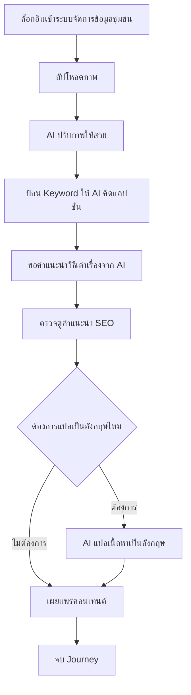

# User Journey: ชุมชน — สร้างและเผยแพร่คอนเทนต์ด้วย AI

- **สถานะ**: DRAFT — ขึ้นกับ Open Question (ดูรายละเอียดที่ [[../../01-requirements/03-task/open-questions|open-questions]])
- **อ้างอิงจาก**: [[../../01-requirements/01-spec/local-story-hub|local-story-hub]]
- **ดู Test Plan ที่แตกจาก journey นี้**: [[../../03-testing/01-test-plan/test-plan|test-plan]] (TC-009–TC-016)

## Diagram

## คำอธิบาย

1. ล็อกอินเข้าระบบจัดการข้อมูลของชุมชนตนเอง — **FR-1.6** [[../../01-requirements/01-spec/local-story-hub|local-story-hub]] `(DRAFT — ขึ้นกับ Open Question: ขอบเขตของ "ระบบจัดการข้อมูล" และสิทธิ์การเข้าถึงของแต่ละชุมชนยังไม่ชัดเจน)`
2. อัปโหลดภาพแล้วให้ AI ช่วยปรับภาพให้สวย — **FR-1.1** [[../../01-requirements/01-spec/local-story-hub|local-story-hub]]
3. ป้อน Keyword ให้ AI คิดแคปชันให้ — **FR-1.2** [[../../01-requirements/01-spec/local-story-hub|local-story-hub]]
4. ขอคำแนะนำจาก AI ว่าเรื่องนี้ควรเล่าอย่างไร — **FR-1.5** [[../../01-requirements/01-spec/local-story-hub|local-story-hub]]
5. ตรวจดูคำแนะนำคำสำคัญ SEO ก่อนเผยแพร่ — **FR-1.4** [[../../01-requirements/01-spec/local-story-hub|local-story-hub]] `(DRAFT — ขึ้นกับ Open Question: ต้องเชื่อมกับ search engine จริงหรือเป็นคำแนะนำภายในระบบเท่านั้น)`
6. เลือกให้ AI แปลเนื้อหาเป็นภาษาอังกฤษ (ทางเลือก) — **FR-1.3** [[../../01-requirements/01-spec/local-story-hub|local-story-hub]] `(DRAFT — ขึ้นกับ Open Question: มีเสียงพากย์ (TTS) หรือข้อความแปลอย่างเดียว)`
7. เผยแพร่คอนเทนต์ผ่านหน้าจอที่อ่านง่าย ตัวอักษรใหญ่ — **FR-1.7** [[../../01-requirements/01-spec/local-story-hub|local-story-hub]]
