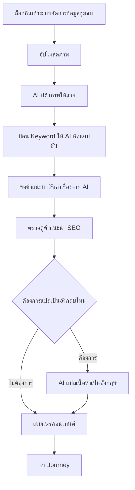

# User Journey: ชุมชน — สร้างและเผยแพร่คอนเทนต์ด้วย AI

- **สถานะ**: Confirmed — ปิด Open Question ที่เคยกระทบ journey นี้ครบทุกจุดแล้วเมื่อ 2026-09-22 (step 1 ล็อกอิน/สิทธิ์การเข้าถึง, step 5 SEO, step 6 รูปแบบการแปล — ดู Business Rules ใน [[../../01-requirements/01-spec/local-story-hub|local-story-hub]])
- **อ้างอิงจาก**: [[../../01-requirements/01-spec/local-story-hub|local-story-hub]]
- **ดู Test Plan ที่แตกจาก journey นี้**: [[../../03-testing/01-test-plan/test-plan|test-plan]] (TC-009–TC-016)
- **ดู Prototype ที่แตกจาก journey นี้**: [[prototype-v1/README|prototype-v1]] (`community-dashboard.html`, `community-create-content.html` — mockup เก่าก่อนการตัดสินใจ 2026-09-22), [[prototype-v3/README|prototype-v3]] (เวอร์ชันปัจจุบันตาม Business Rules ที่ปิดแล้ว)
- **ดู Architecture (conceptual) ที่ใช้ journey นี้ประกอบ**: [[../02-technical/architecture|architecture]]
- **ดู Detailed Design (Sequence Flow) ที่ใช้ journey นี้ประกอบ**: [[../02-technical/detailed-design|detailed-design]]

## Diagram

## คำอธิบาย

1. ล็อกอินเข้าระบบจัดการข้อมูลของชุมชนตนเอง — **FR-1.6** [[../../01-requirements/01-spec/local-story-hub|local-story-hub]] `(ปิด Open Question แล้ว 2026-09-22 — ขอบเขต "ระบบจัดการข้อมูล" = เฉพาะคอนเทนต์, สิทธิ์การเข้าถึง = ใช้ข้อมูลร่วมกันระหว่างชุมชน ไม่ isolate เต็มรูปแบบ ดู Business Rules ใน local-story-hub.md — ดูเพิ่มเติมเรื่องสมัคร/อนุมัติบัญชีชุมชนที่ [[community-account-registration-journey|community-account-registration-journey]] และการขอแก้ไขคอนเทนต์หลังเผยแพร่แล้วที่ [[community-content-edit-request-journey|community-content-edit-request-journey]])`
2. อัปโหลดภาพแล้วให้ AI ช่วยปรับภาพให้สวย — **FR-1.1** [[../../01-requirements/01-spec/local-story-hub|local-story-hub]]
3. ป้อน Keyword ให้ AI คิดแคปชันให้ — **FR-1.2** [[../../01-requirements/01-spec/local-story-hub|local-story-hub]]
4. ขอคำแนะนำจาก AI ว่าเรื่องนี้ควรเล่าอย่างไร — **FR-1.5** [[../../01-requirements/01-spec/local-story-hub|local-story-hub]]
5. ตรวจดูคำแนะนำคำสำคัญ SEO ก่อนเผยแพร่ — **FR-1.4** [[../../01-requirements/01-spec/local-story-hub|local-story-hub]] `(ปิด Open Question แล้ว 2026-09-22 — เป็นคำแนะนำภายในระบบเท่านั้น ไม่เชื่อมกับ search engine จริง)`
6. เลือกให้ AI แปลเนื้อหาเป็นภาษาอังกฤษ (ทางเลือก) — **FR-1.3** [[../../01-requirements/01-spec/local-story-hub|local-story-hub]] `(ปิด Open Question แล้ว 2026-09-22 — เป็นข้อความแปลอย่างเดียว ไม่มีเสียงพากย์)`
7. เผยแพร่คอนเทนต์ผ่านหน้าจอที่อ่านง่าย ตัวอักษรใหญ่ — **FR-1.7** [[../../01-requirements/01-spec/local-story-hub|local-story-hub]]
