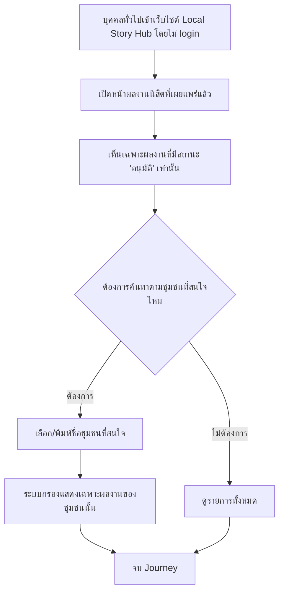

# User Journey: บุคคลทั่วไป (ไม่ Login) — ดูและค้นหาผลงานนิสิตที่เผยแพร่แล้ว

- **สถานะ**: Confirmed — ปิด Open Question ที่เคยกระทบ journey นี้ครบทุกจุดแล้วเมื่อ 2026-09-22 (ขอบเขตการค้นหา = เฉพาะชื่อชุมชน, ตำแหน่งหน้าจอ = หน้าแยกต่างหาก — ดู Business Rules ใน [[../../01-requirements/01-spec/20260912-02-public-view-search-published-works|20260912-02-public-view-search-published-works]])
- **อ้างอิงจาก**: [[../../01-requirements/01-spec/20260912-02-public-view-search-published-works|20260912-02-public-view-search-published-works]]
- **ดู Architecture (conceptual) ที่ใช้ journey นี้ประกอบ**: [[../02-technical/architecture|architecture]] (API operation "ดู/ค้นหาผลงานนิสิตที่เผยแพร่แล้ว" — public)
- **ดู ACL (สิทธิ์การเข้าถึง) ที่เกี่ยวข้อง**: [[../02-technical/ACL|ACL]]
- **ดู Test Plan ที่แตกจาก journey นี้**: [[../../03-testing/01-test-plan/test-plan|test-plan]]
- **ดู Prototype ที่แตกจาก journey นี้ (implement จริงแล้วก่อนมี journey diagram รองรับ)**: [[prototype-v2/README|prototype-v2]] (`published-works.html`)

## Diagram

## คำอธิบาย

1. บุคคลทั่วไปเข้าเว็บไซต์ Local Story Hub โดยไม่ต้อง login — บริบททั่วไป ไม่มี FR เฉพาะ
2. เปิดหน้าผลงานนิสิตที่เผยแพร่แล้ว — **FR-1** [[../../01-requirements/01-spec/20260912-02-public-view-search-published-works|20260912-02-public-view-search-published-works]] `(ปิด Open Question แล้ว 2026-09-22 — เป็นหน้าใหม่แยกต่างหาก ไม่รวมกับ tourist-search-results.html)`
3. เห็นเฉพาะผลงานที่มีสถานะ "อนุมัติ" เท่านั้น — ผลงานที่ "รอพิจารณา" หรือ "ไม่อนุมัติ" ไม่แสดง/เข้าถึงไม่ได้เลยไม่ว่าทางใด — **FR-1, FR-3**
4. เลือก/พิมพ์ค้นหาตามชื่อชุมชนที่สนใจ — **FR-2** `(ปิด Open Question แล้ว 2026-09-22 — ค้นหาเฉพาะตามชื่อชุมชนเท่านั้น ไม่รวมชื่อผลงาน/คำในเนื้อหา)`
5. ระบบกรองแสดงเฉพาะผลงานของชุมชนที่เลือก (หรือทั้งหมดถ้าไม่เลือกกรอง) — **FR-2**
6. การกระทำอื่นนอกเหนือจากดู/ค้นหา (ส่งผลงาน, สมัครบัญชี, อนุมัติ/ไม่อนุมัติ, รีวิว, บันทึกสถานที่โปรด ฯลฯ) ยังคงต้อง login เหมือนเดิม ไม่มีสิทธิ์เพิ่มเติมให้ผู้เยี่ยมชม — **FR-4**
