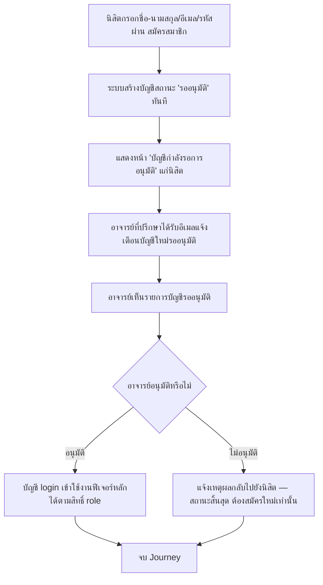

# User Journey: นิสิต — สมัคร/อนุมัติบัญชีผู้ใช้ใหม่ (นิสิต → อาจารย์)

- **สถานะ**: Confirmed — ไม่มี Open Question ที่กระทบ journey นี้ (สเปคต้นทางปิด Open Question ครบทุกข้อแล้วเมื่อ 2026-09-12 — ดู [[../../01-requirements/03-task/open-questions|open-questions]])
- **อ้างอิงจาก**: [[../../01-requirements/01-spec/20260912-01-account-registration-approval|20260912-01-account-registration-approval]]
- **ดู Architecture (conceptual, Data Flow) ที่ใช้ journey นี้ประกอบ**: [[../02-technical/architecture|architecture]] § "สมัคร/อนุมัติบัญชีผู้ใช้ใหม่ (นิสิต → อาจารย์)"
- **ดู ACL (สิทธิ์การเข้าถึง) ที่เกี่ยวข้อง**: [[../02-technical/ACL|ACL]]
- **ดู Test Plan ที่แตกจาก journey นี้**: [[../../03-testing/01-test-plan/test-plan|test-plan]]
- **ดู Prototype ที่แตกจาก journey นี้ (implement จริงแล้วก่อนมี journey diagram รองรับ)**: [[prototype-v2/README|prototype-v2]] (`student-publish.html` — หน้าสมัคร/login, `admin-review-student-work.html` — หน้าอนุมัติของอาจารย์)

## Diagram

## คำอธิบาย

1. นิสิตกรอกชื่อ-นามสกุล, อีเมล, รหัสผ่าน แล้วสมัครบัญชีเอง — **FR-1** [[../../01-requirements/01-spec/20260912-01-account-registration-approval|20260912-01-account-registration-approval]]
2. บัญชีใหม่มีสถานะเริ่มต้น "รออนุมัติ" ทันที — เข้าใช้งานฟีเจอร์หลัก (ส่งผลงาน/ตรวจสอบผลงาน) ไม่ได้จนกว่าจะได้รับอนุมัติ — **FR-2**
3. ระบบแจ้งเตือนอาจารย์ที่ปรึกษาทางอีเมลของอาจารย์เมื่อมีบัญชีใหม่สมัครเข้ามารออนุมัติ — **FR-3**
4. อาจารย์ที่ปรึกษาเห็นรายการบัญชีที่รออนุมัติ และกดอนุมัติ/ไม่อนุมัติพร้อมระบุเหตุผลได้ — **FR-4**
5. อนุมัติแล้ว → บัญชีนั้น login เข้าใช้งานได้ตามสิทธิ์ของ role ตน (ดู [[../02-technical/ACL|ACL.md]]) — **FR-5**
6. ไม่อนุมัติ (ถูกปฏิเสธ) → login เข้าใช้งานไม่ได้อีก ระบบแจ้งเหตุผลที่ไม่อนุมัติกลับไปยังผู้สมัคร และผู้สมัครต้องสมัครบัญชีใหม่เท่านั้น (ไม่มีการแก้ไข/ส่งคำขอซ้ำกับบัญชีเดิม) — **FR-6**
