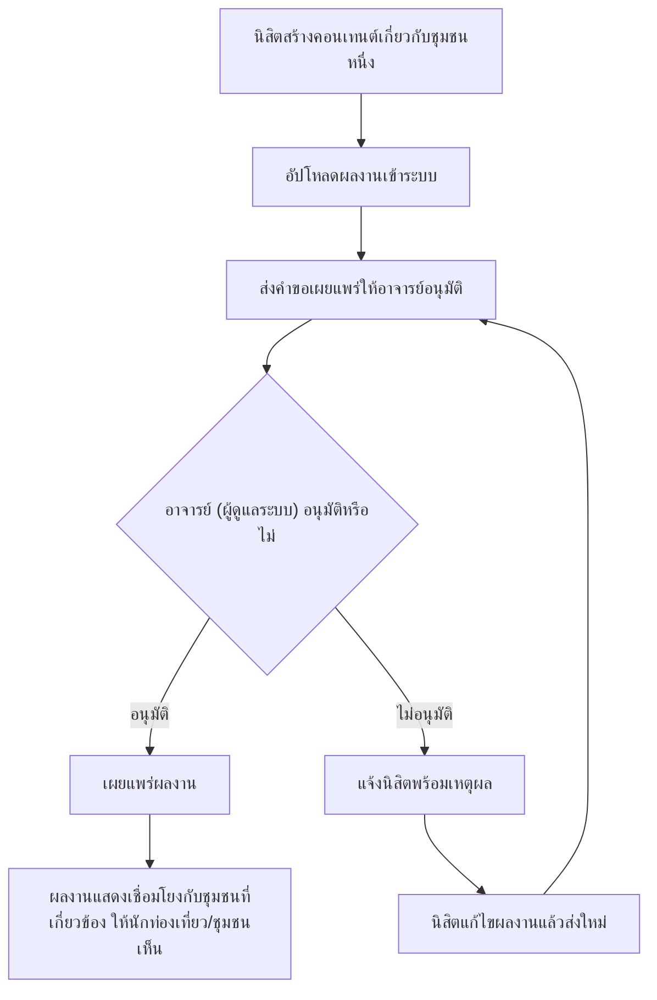

# User Journey: นิสิตนิเทศศาสตร์ — สร้างและเผยแพร่ผลงานสนับสนุนชุมชน

- **สถานะ**: Confirmed — ปิด Open Question ที่เคยกระทบ journey นี้ครบทุกจุดแล้วเมื่อ 2026-09-22 (รวมจำนวนครั้งส่งใหม่ที่ step 5 = ไม่จำกัด — ดู Business Rules ใน [[../../01-requirements/01-spec/local-story-hub|local-story-hub]])
- **อ้างอิงจาก**: [[../../01-requirements/01-spec/local-story-hub|local-story-hub]]
- **ดู Test Plan ที่แตกจาก journey นี้**: [[../../03-testing/01-test-plan/test-plan|test-plan]] (TC-023–TC-026 — renumber 2026-09-22 เดิมคือ TC-017–TC-020)
- **ดู Prototype ที่แตกจาก journey นี้**: [[prototype-v1/README|prototype-v1]] (`student-publish.html`, `admin-review-student-work.html` — เพิ่ม 2026-09-04)
- **ดู Architecture (conceptual) ที่ใช้ journey นี้ประกอบ**: [[../02-technical/architecture|architecture]]
- **ดู Detailed Design (Sequence Flow) ที่ใช้ journey นี้ประกอบ**: [[../02-technical/detailed-design|detailed-design]]

> **อัปเดต 2026-09-04**: Business Rule เรื่องการอนุมัติ**ถูกกลับคำตัดสินใจอีกครั้ง** — เดิม (2026-08-22) เคยตอบว่าไม่ต้องอนุมัติ ผู้ใช้แก้ไขให้**ต้องผ่านการอนุมัติจากอาจารย์ (ผู้ดูแลระบบ) ก่อนเผยแพร่เสมอ** diagram ด้านล่างจึงใส่เส้นทางอนุมัติกลับเข้ามา — Open Question ที่ยังเหลืออยู่คือวิธีเชื่อมโยงผลงานกับพื้นที่ของชุมชน

## Diagram

## คำอธิบาย

1. นิสิตสร้างคอนเทนต์ที่เกี่ยวกับชุมชนใดชุมชนหนึ่ง — **FR-3.1** [[../../01-requirements/01-spec/local-story-hub|local-story-hub]]
2. อัปโหลดผลงานเข้าระบบ — **FR-3.1** [[../../01-requirements/01-spec/local-story-hub|local-story-hub]]
3. ส่งคำขอเผยแพร่ให้อาจารย์ (ผู้ดูแลระบบ) อนุมัติ — **FR-3.1** [[../../01-requirements/01-spec/local-story-hub|local-story-hub]] (Business Rule ที่แก้ไขล่าสุด 2026-09-04)
4. ถ้าอาจารย์อนุมัติ → เผยแพร่ผลงาน — **FR-3.1**
5. ถ้าอาจารย์ไม่อนุมัติ → แจ้งนิสิตพร้อมเหตุผล → นิสิตแก้ไขแล้วส่งใหม่ (วนกลับไปข้อ 3) `(ปิด Open Question แล้ว 2026-09-22 — ส่งใหม่ได้ไม่จำกัดจำนวนครั้ง)`
6. ผลงานที่เผยแพร่แล้วแสดงเชื่อมโยงกับชุมชนที่เกี่ยวข้อง ให้นักท่องเที่ยว/ชุมชนเห็นได้ — **FR-3.1** [[../../01-requirements/01-spec/local-story-hub|local-story-hub]] `(ปิด Open Question แล้ว 2026-09-22 — นิสิตเลือกชุมชนจาก dropdown ตอนอัปโหลด)`
