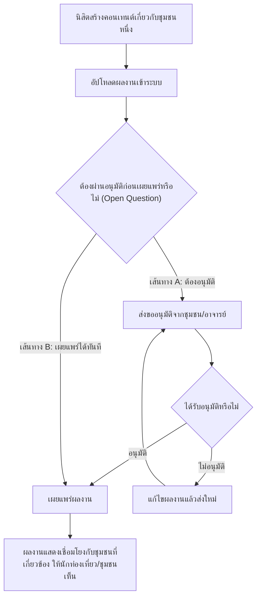

# User Journey: นิสิตนิเทศศาสตร์ — สร้างและเผยแพร่ผลงานสนับสนุนชุมชน

- **สถานะ**: DRAFT — Open Question เชิงโครงสร้าง (ดูรายละเอียดที่ [[../../01-requirements/03-task/open-questions|open-questions]])
- **อ้างอิงจาก**: [[../../01-requirements/01-spec/local-story-hub|local-story-hub]]

> **หมายเหตุสำคัญ**: Journey นี้มี Open Question ที่กระทบ **โครงสร้าง** ของ journey โดยตรง — ยังไม่รู้ว่าผลงานของนิสิตต้องผ่านการอนุมัติจากชุมชน/อาจารย์ก่อนเผยแพร่หรือไม่ Diagram ด้านล่างจึงวาดไว้ **ทั้งสองเส้นทางที่เป็นไปได้** เพื่อให้เห็นทางเลือกชัดเจน แทนการเดาว่าจะเป็นเส้นทางไหน

## Diagram

## คำอธิบาย

1. นิสิตสร้างคอนเทนต์ที่เกี่ยวกับชุมชนใดชุมชนหนึ่ง — **FR-3.1** [[../../01-requirements/01-spec/local-story-hub|local-story-hub]]
2. อัปโหลดผลงานเข้าระบบ — **FR-3.1** [[../../01-requirements/01-spec/local-story-hub|local-story-hub]]
3. `(DRAFT — Open Question เชิงโครงสร้าง)` จุดตัดสินใจ: ต้องผ่านการอนุมัติจากชุมชน/อาจารย์ก่อนเผยแพร่หรือไม่ — สเปคต้นทางระบุไว้ตรง ๆ ว่ายังไม่ทราบ — **FR-3.1** [[../../01-requirements/01-spec/local-story-hub|local-story-hub]]
   - **เส้นทาง A (มีอนุมัติ)**: ส่งขออนุมัติ → ถ้าไม่ผ่านให้แก้ไขแล้วส่งใหม่ → ถ้าผ่านจึงเผยแพร่
   - **เส้นทาง B (ไม่มีอนุมัติ)**: เผยแพร่ได้ทันทีหลังอัปโหลด
4. ผลงานที่เผยแพร่แล้วแสดงเชื่อมโยงกับชุมชนที่เกี่ยวข้อง ให้นักท่องเที่ยว/ชุมชนเห็นได้ — **FR-3.1** [[../../01-requirements/01-spec/local-story-hub|local-story-hub]]
