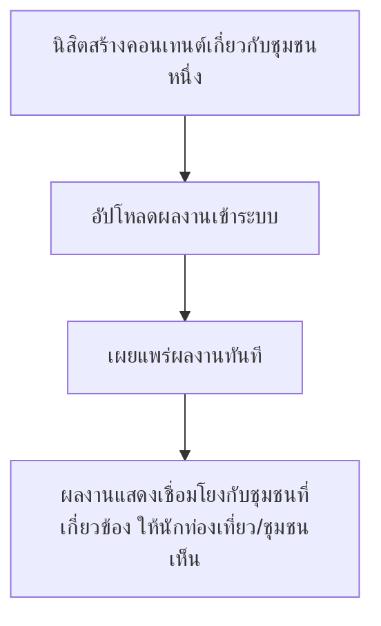

# User Journey: นิสิตนิเทศศาสตร์ — สร้างและเผยแพร่ผลงานสนับสนุนชุมชน

- **สถานะ**: DRAFT — ยังมี Open Question ปลีกย่อยเหลืออยู่ (ดูรายละเอียดที่ [[../../01-requirements/03-task/open-questions|open-questions]])
- **อ้างอิงจาก**: [[../../01-requirements/01-spec/local-story-hub|local-story-hub]]
- **ดู Test Plan ที่แตกจาก journey นี้**: [[../../03-testing/01-test-plan/test-plan|test-plan]] (TC-017–TC-018)
- **ดู Prototype ที่แตกจาก journey นี้**: [[prototype-v1/README|prototype-v1]] (`student-publish.html`)

> **อัปเดต 2026-08-22**: Open Question เชิงโครงสร้าง ("ต้องผ่านอนุมัติก่อนเผยแพร่หรือไม่") ที่เคยทำให้ journey นี้มีสองเส้นทางที่เป็นไปได้ **ถูกตอบแล้ว — ไม่ต้องผ่านอนุมัติ** (บันทึกเป็น Business Rule ใน `local-story-hub.md` แล้ว) diagram ด้านล่างจึงตัดเส้นทางอนุมัติออก เหลือ Open Question ปลีกย่อยอีกข้อเดียวคือวิธีเชื่อมโยงผลงานกับพื้นที่ของชุมชน

## Diagram

## คำอธิบาย

1. นิสิตสร้างคอนเทนต์ที่เกี่ยวกับชุมชนใดชุมชนหนึ่ง — **FR-3.1** [[../../01-requirements/01-spec/local-story-hub|local-story-hub]]
2. อัปโหลดผลงานเข้าระบบ — **FR-3.1** [[../../01-requirements/01-spec/local-story-hub|local-story-hub]]
3. เผยแพร่ผลงานทันที ไม่ต้องผ่านการอนุมัติจากชุมชนหรืออาจารย์ก่อน — **FR-3.1** [[../../01-requirements/01-spec/local-story-hub|local-story-hub]] (Business Rule ที่ยืนยันแล้ว 2026-08-22)
4. ผลงานที่เผยแพร่แล้วแสดงเชื่อมโยงกับชุมชนที่เกี่ยวข้อง ให้นักท่องเที่ยว/ชุมชนเห็นได้ — **FR-3.1** [[../../01-requirements/01-spec/local-story-hub|local-story-hub]] `(DRAFT — ขึ้นกับ Open Question: วิธีเชื่อมโยงผลงานกับพื้นที่ของชุมชนยังไม่ระบุ เช่น นิสิตต้องเลือกชุมชนตอนอัปโหลดหรือไม่)`
