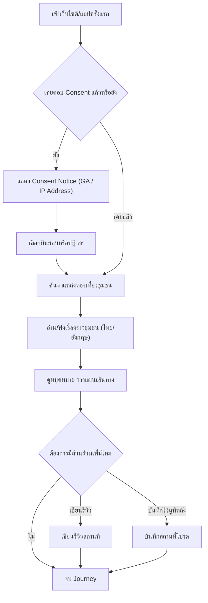

# User Journey: นักท่องเที่ยว — ค้นหาและวางแผนเที่ยวชุมชน

- **สถานะ**: DRAFT — ขึ้นกับ Open Question (ดูรายละเอียดที่ [[../../01-requirements/03-task/open-questions|open-questions]])
- **อ้างอิงจาก**: [[../../01-requirements/01-spec/local-story-hub|local-story-hub]], [[../../01-requirements/01-spec/20260822-01-it-log-pdpa-consent|20260822-01-it-log-pdpa-consent]]
- **ดู Test Plan ที่แตกจาก journey นี้**: [[../../03-testing/01-test-plan/test-plan|test-plan]] (TC-001–TC-008)

## Diagram

## คำอธิบาย

1. เข้าเว็บไซต์/แอปครั้งแรก แล้วเช็คว่าเคยตอบ Consent มาก่อนหรือยัง — **FR-2 (IT log/PDPA)** [[../../01-requirements/01-spec/20260822-01-it-log-pdpa-consent|20260822-01-it-log-pdpa-consent]] `(DRAFT — ขึ้นกับ Open Question: รูปแบบ Consent แบบ granular หรือแบบเดียว ยังไม่ตัดสินใจ)`
2. ถ้ายังไม่เคยตอบ ระบบแสดง Consent Notice แล้วให้เลือกยินยอมหรือปฏิเสธ — **FR-3** [[../../01-requirements/01-spec/20260822-01-it-log-pdpa-consent|20260822-01-it-log-pdpa-consent]] `(DRAFT — เหตุผลเดียวกับข้อ 1)`
3. สืบค้นแหล่งท่องเที่ยวชุมชนที่ต้องการ — **FR-2.1** [[../../01-requirements/01-spec/local-story-hub|local-story-hub]]
4. อ่าน/ฟังเรื่องราวของชุมชนได้ทั้งภาษาไทยและอังกฤษ — **FR-2.2** [[../../01-requirements/01-spec/local-story-hub|local-story-hub]] `(DRAFT — ขึ้นกับ Open Question: ยืนยันเฉพาะไทย-อังกฤษหรือมีภาษาอื่นด้วย, และมีเสียงพากย์ (TTS) หรือข้อความแปลอย่างเดียว)`
5. ดูหมุดหมายเดินทางและวางแผนเส้นทาง — **FR-2.3** [[../../01-requirements/01-spec/local-story-hub|local-story-hub]]
6. เขียนรีวิวสถานที่ (ทางเลือก) — **FR-2.4** [[../../01-requirements/01-spec/local-story-hub|local-story-hub]]
7. บันทึกสถานที่โปรดไว้ดูภายหลัง (ทางเลือก) — **FR-2.5** [[../../01-requirements/01-spec/local-story-hub|local-story-hub]]
