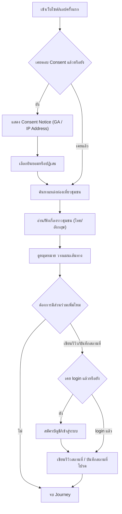

# User Journey: นักท่องเที่ยว — ค้นหาและวางแผนเที่ยวชุมชน

- **สถานะ**: Confirmed — ปิด Open Question ที่เคยกระทบ journey นี้ครบทุกจุดแล้วเมื่อ 2026-09-22 (ดู Business Rules ใน [[../../01-requirements/01-spec/20260822-01-it-log-pdpa-consent|20260822-01-it-log-pdpa-consent]] และ [[../../01-requirements/01-spec/local-story-hub|local-story-hub]]) — **ความไม่สอดคล้องเรื่อง login ที่เคยค้างอยู่ (ดูประวัติใน [[../../05-log/index|05-log]]) แก้ไขแล้วเมื่อ 2026-09-22** ทั้ง journey นี้และ [[prototype-v1/README|prototype-v1]] ตรงกับ decision 2026-08-28 แล้ว
- **อ้างอิงจาก**: [[../../01-requirements/01-spec/local-story-hub|local-story-hub]], [[../../01-requirements/01-spec/20260822-01-it-log-pdpa-consent|20260822-01-it-log-pdpa-consent]]
- **ดู Test Plan ที่แตกจาก journey นี้**: [[../../03-testing/01-test-plan/test-plan|test-plan]] (TC-001–TC-008)
- **ดู Prototype ที่แตกจาก journey นี้**: [[prototype-v1/README|prototype-v1]] (`tourist-home-consent.html`, `tourist-search-results.html`, `tourist-story-detail.html`, `tourist-login.html` — เพิ่ม 2026-09-22)
- **ดู Architecture (conceptual) ที่ใช้ journey นี้ประกอบ**: [[../02-technical/architecture|architecture]]
- **ดู Detailed Design (Sequence Flow) ที่ใช้ journey นี้ประกอบ**: [[../02-technical/detailed-design|detailed-design]] (sequence เรื่องรีวิวตรงกับ journey นี้แล้วตั้งแต่ 2026-09-22)

## Diagram

## คำอธิบาย

1. เข้าเว็บไซต์/แอปครั้งแรก แล้วเช็คว่าเคยตอบ Consent มาก่อนหรือยัง — **FR-2 (IT log/PDPA)** [[../../01-requirements/01-spec/20260822-01-it-log-pdpa-consent|20260822-01-it-log-pdpa-consent]] `(ปิด Open Question แล้ว 2026-09-22 — Consent เป็นแบบเดียว ยอมรับ/ปฏิเสธทั้งหมด ไม่ใช่ granular)`
2. ถ้ายังไม่เคยตอบ ระบบแสดง Consent Notice แล้วให้เลือกยินยอมหรือปฏิเสธ — **FR-3** [[../../01-requirements/01-spec/20260822-01-it-log-pdpa-consent|20260822-01-it-log-pdpa-consent]] `(ปิด Open Question แล้ว 2026-09-22 — เหตุผลเดียวกับข้อ 1)`
3. สืบค้นแหล่งท่องเที่ยวชุมชนที่ต้องการ — **FR-2.1** [[../../01-requirements/01-spec/local-story-hub|local-story-hub]] (ไม่ต้อง login)
4. อ่าน/ฟังเรื่องราวของชุมชนได้ทั้งภาษาไทยและอังกฤษ — **FR-2.2** [[../../01-requirements/01-spec/local-story-hub|local-story-hub]] `(ปิด Open Question แล้ว 2026-09-22 — รองรับเฉพาะไทย-อังกฤษ และเป็นข้อความแปลอย่างเดียว ไม่มีเสียงพากย์ (TTS))` (ไม่ต้อง login)
5. ดูหมุดหมายเดินทางและวางแผนเส้นทาง — **FR-2.3** [[../../01-requirements/01-spec/local-story-hub|local-story-hub]] (ไม่ต้อง login)
6. เขียนรีวิวสถานที่ หรือ บันทึกสถานที่โปรด (ทางเลือก) — **FR-2.4, FR-2.5** [[../../01-requirements/01-spec/local-story-hub|local-story-hub]] — **ต้องมีบัญชีผู้ใช้ (login เต็มรูปแบบ) ก่อนเสมอ** (Decision Log 2026-08-28 ใน [[../02-technical/architecture|architecture.md]]) หากยังไม่เคย login ระบบพาไปสมัครบัญชี/เข้าสู่ระบบก่อน แล้วจึงกลับมาทำรายการต่อ — แก้ไขให้ตรงกับ decision นี้แล้วเมื่อ 2026-09-22 (เดิม prototype-v1 ทำได้โดยไม่ต้อง login มาก่อน)
