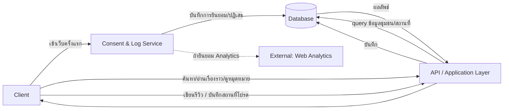
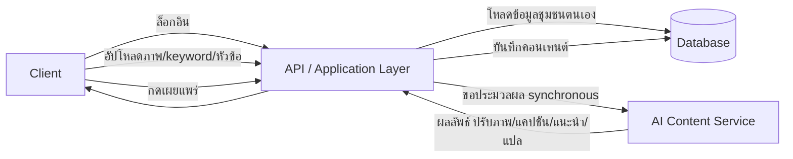
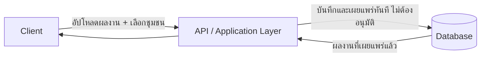

# High-Level Architecture (Conceptual)

- **สถานะ**: Draft — conceptual เท่านั้น ยังไม่ผูกมัดกับ technical stack (framework/ภาษา/ยี่ห้อฐานข้อมูล/cloud) ใด ๆ
- **อ้างอิงจาก**: [[../../01-requirements/01-spec/local-story-hub|local-story-hub]], [[../../01-requirements/01-spec/20260822-01-it-log-pdpa-consent|20260822-01-it-log-pdpa-consent]], [[../../01-requirements/03-task/feature-list|feature-list]], [[../01-prototypes/tourist-journey|tourist-journey]], [[../01-prototypes/community-content-journey|community-content-journey]], [[../01-prototypes/student-content-journey|student-content-journey]]
- **ดู Database Schema + API Spec ที่ต่อยอดจากไฟล์นี้**: [[data-api-spec|data-api-spec]]
- **ดู Detailed Design (Sequence Flow) ที่ต่อยอดจากไฟล์นี้**: [[detailed-design|detailed-design]]

## Context

สถาปัตยกรรมนี้อธิบาย Local Story Hub ในระดับแนวคิด — component มีอะไรบ้างและข้อมูลไหลอย่างไร ไม่ใช่วิธี implement จริง เพราะยังมี Open Question สำคัญ (เช่น แพลตฟอร์ม Website/Application) ที่ยังไม่ปิด จึงตั้งใจให้ทุก component อธิบายด้วยหน้าที่ (function) ไม่ใช่ชื่อเทคโนโลยี เพื่อให้เอกสารนี้ยังใช้ได้ไม่ว่าจะเลือก stack ใดในภายหลัง

## Component หลัก

| Component | หน้าที่ |
|---|---|
| **Client** | ส่วนติดต่อผู้ใช้ทั้ง 3 กลุ่ม (ชุมชน, นักท่องเที่ยว, นิสิต) — เป็น Website และ/หรือ Application (ยังเป็น Open Question — ดูหัวข้อ Open Items) สไตล์/component ตาม [[../01-prototypes/DESIGN|DESIGN.md]] |
| **API / Application Layer** | รับคำขอจาก Client, ควบคุม business logic และสิทธิ์การเข้าถึง, ประสานงานกับ component อื่นทั้งหมด — เป็นจุดเดียวที่ Client คุยด้วยโดยตรง |
| **AI Content Service** | ปรับภาพ (FR-1.1), คิดแคปชัน (FR-1.2), แปลภาษา (FR-1.3), แนะนำ SEO (FR-1.4), แนะนำวิธีเล่าเรื่อง (FR-1.5) — ทำงานแบบ **Synchronous** (ดู Decision Log) |
| **Consent & Log Service** | แสดง/บันทึก Consent (BL-015, BL-016), บันทึก access log ของผู้ใช้งานทุกคนอย่างน้อย 90 วัน (BL-014), เก็บหลักฐาน consent (BL-017) |
| **Database** | เก็บข้อมูลหลักของระบบทั้งหมด (ชุมชน, คอนเทนต์, ผู้ใช้, รีวิว, ผลงานนิสิต, บันทึก consent, log) — ดูรายละเอียด entity ที่ [[data-api-spec|data-api-spec]] |
| **External: Web Analytics** | เชื่อมต่อ Google Analytics เฉพาะเมื่อผู้ใช้ยินยอม (ผูกกับ Consent & Log Service) |

## Data Flow ตาม User Journey

### นักท่องเที่ยว — [[../01-prototypes/tourist-journey|tourist-journey]]

อ้างอิง: FR-2.1–2.5 ([[../../01-requirements/01-spec/local-story-hub|local-story-hub]]), FR-2/FR-3 ([[../../01-requirements/01-spec/20260822-01-it-log-pdpa-consent|20260822-01-it-log-pdpa-consent]])

### ชุมชน — [[../01-prototypes/community-content-journey|community-content-journey]]

อ้างอิง: FR-1.1–1.7 ([[../../01-requirements/01-spec/local-story-hub|local-story-hub]])

### นิสิตนิเทศศาสตร์ — [[../01-prototypes/student-content-journey|student-content-journey]]

อ้างอิง: FR-3.1 ([[../../01-requirements/01-spec/local-story-hub|local-story-hub]]) — การอนุมัติก่อนเผยแพร่ถูกตอบแล้วว่าไม่ต้องมี (ดู Business Rules ในสเปค)

## ประเด็นข้ามระบบ (Cross-cutting concerns)

- **Consent & Logging** ต้องเกิดกับทุกคำขอที่ Client ส่งเข้ามา ไม่ใช่แค่หน้าแรก — แนวคิดคือ Consent & Log Service ทำงานคู่ขนานกับทุก request ผ่าน API layer
- **การเข้าถึงง่ายสำหรับผู้สูงอายุ** (FR-1.7) เป็นความรับผิดชอบของ Client ตาม [[../01-prototypes/DESIGN|DESIGN.md]] ไม่ใช่ประเด็นสถาปัตยกรรม backend
- **ขอบเขตของ "ระบบจัดการข้อมูลชุมชน"** (Open Question) จะกระทบรายละเอียดภายในของ API/Database layer แต่ไม่กระทบ component ระดับสูงที่ระบุไว้ในเอกสารนี้
- **Non-functional requirements** (performance, จำนวนผู้ใช้, ความปลอดภัย) ยังไม่ถูกระบุในสเปค — สถาปัตยกรรมนี้ออกแบบไว้สำหรับสเกลระดับชุมชน/มหาวิทยาลัย (ผู้ใช้พร้อมกันไม่มาก) ยังไม่ได้ optimize สำหรับ traffic สูง ควรทบทวนเมื่อมีข้อมูลเพิ่ม

## Decision Log

- **2026-08-28** — เลือกให้ AI Content Service ทำงานแบบ **Synchronous** (ผู้ใช้กดแล้วรอผลทันที) แทนการใช้คิว/asynchronous เหตุผล: สอดคล้องกับ [[../01-prototypes/prototype-v1/README|prototype-v1]] ที่ออกแบบปุ่ม AI เป็น synchronous ไว้แล้วทั้งหมด และขนาดงาน (ปรับภาพเดี่ยว, ข้อความสั้น) ยังไม่ถึงระดับที่จำเป็นต้องพึ่งคิว — ผู้ใช้ยืนยันตัวเลือกนี้เอง (มีอีก 2 ทางเลือกที่พิจารณาแล้วไม่เลือก: Asynchronous ผ่านคิว, Hybrid)

## Open Items ที่กระทบสถาปัตยกรรมในอนาคต

ดูรายละเอียดเต็มที่ [[../../01-requirements/03-task/open-questions|open-questions]] — ที่กระทบเอกสารนี้โดยตรง:

1. **แพลตฟอร์ม (Website/Application)** — กระทบรายละเอียดของ Client component (ยังออกแบบระดับ high-level ได้โดยไม่ต้องรู้คำตอบ)
2. **ขอบเขตของ "ระบบจัดการข้อมูลชุมชน"** — กระทบรายละเอียดภายในของ API/Database layer
3. **Non-functional requirements** — กระทบการตัดสินใจเรื่อง scalability/security ในรายละเอียดของ Detailed Design ต่อไป
