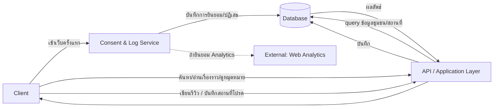
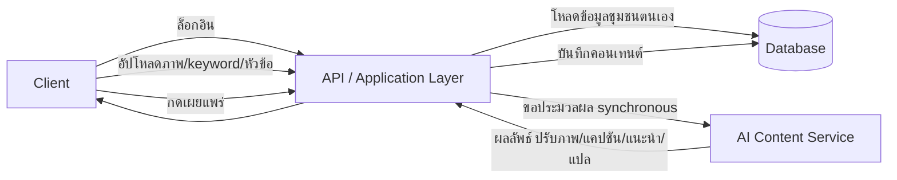
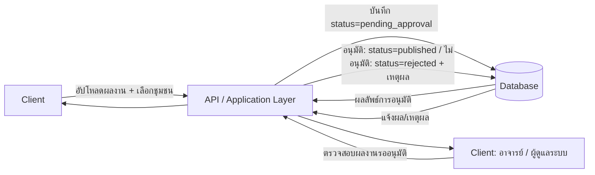
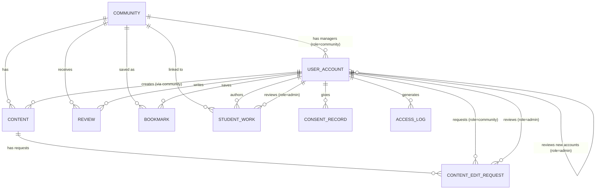

# High-Level Design (Conceptual) — ภาพรวมระบบ

- **สถานะ**: Draft — conceptual เท่านั้น ยังไม่ผูกมัดกับ technical stack (framework/ภาษา/ยี่ห้อฐานข้อมูล/cloud) ใด ๆ
- **อ้างอิงจาก**: [[../../01-requirements/01-spec/local-story-hub|local-story-hub]], [[../../01-requirements/01-spec/20260822-01-it-log-pdpa-consent|20260822-01-it-log-pdpa-consent]], [[../../01-requirements/03-task/feature-list|feature-list]], [[../01-prototypes/tourist-journey|tourist-journey]], [[../01-prototypes/community-content-journey|community-content-journey]], [[../01-prototypes/student-content-journey|student-content-journey]]
- **ดู Detailed Design (Sequence Flow) ที่ต่อยอดจากไฟล์นี้**: [[detailed-design|detailed-design]]

> **ไฟล์นี้คือภาพรวมระบบไฟล์เดียว** — รวม High-Level Architecture, Database Schema (ER Diagram + entity), และ API Spec ไว้ด้วยกัน เพื่อให้เรียกใช้งานง่าย ไม่ต้องเปิดหลายไฟล์ (ตามที่ผู้ใช้ขอ 2026-08-28) — รายละเอียดระดับ sequence/interaction แยกไว้ที่ [[detailed-design|detailed-design]] เพราะเป็นรายละเอียดที่ลึกกว่าระดับภาพรวม

## Context

เอกสารนี้อธิบาย Local Story Hub ในระดับแนวคิด — component มีอะไรบ้าง, ข้อมูลไหลอย่างไร, เก็บข้อมูลอะไรบ้าง, และมี API operation อะไรบ้าง ไม่ใช่วิธี implement จริง แม้ Open Question ที่กระทบ scope ใหญ่ (แพลตฟอร์ม, สิทธิ์การเข้าถึงข้อมูลชุมชน, ขอบเขตระบบจัดการข้อมูล) จะปิดครบแล้ว (2026-09-22 — ดู Decision Log) เอกสารนี้ยังตั้งใจอธิบายด้วยหน้าที่/แนวคิดต่อไป ไม่ระบุชื่อเทคโนโลยีเฉพาะเจาะจง เพื่อให้ยังใช้ได้ไม่ว่าจะเลือก stack ใดตอน implement จริง

## Component หลัก

| Component | หน้าที่ |
|---|---|
| **Client** | ส่วนติดต่อผู้ใช้ทั้ง 3 กลุ่ม (ชุมชน, นักท่องเที่ยว, นิสิต) — เป็น **Website** เท่านั้น (ตัดสินใจ 2026-09-22 — ดู Decision Log) สไตล์/component ตาม [[../01-prototypes/DESIGN|DESIGN.md]] |
| **API / Application Layer** | รับคำขอจาก Client, ควบคุม business logic และสิทธิ์การเข้าถึง, ประสานงานกับ component อื่นทั้งหมด — เป็นจุดเดียวที่ Client คุยด้วยโดยตรง |
| **AI Content Service** | ปรับภาพ (FR-1.1), คิดแคปชัน (FR-1.2), แปลภาษา (FR-1.3), แนะนำ SEO (FR-1.4), แนะนำวิธีเล่าเรื่อง (FR-1.5) — ทำงานแบบ **Synchronous** (ดู Decision Log) |
| **Consent & Log Service** | แสดง/บันทึก Consent (BL-015, BL-016), บันทึก access log ของผู้ใช้งานทุกคนอย่างน้อย 90 วัน (BL-014), เก็บหลักฐาน consent (BL-017) |
| **Database** | เก็บข้อมูลหลักของระบบทั้งหมด — ดูรายละเอียด entity ในหัวข้อ "Database Schema" ด้านล่าง |
| **Notification Service** | ส่งอีเมลแจ้งเตือนอาจารย์ที่ปรึกษา/แอดมินเมื่อมี (ก) บัญชีผู้ใช้ใหม่รออนุมัติ — นิสิต (เพิ่ม 2026-09-12 ตาม [[../../01-requirements/01-spec/20260912-01-account-registration-approval\|20260912-01-account-registration-approval]]) หรือชุมชน (เพิ่ม 2026-09-22, BL-022) — หรือ (ข) คำขอแก้ไขข้อมูลชุมชนรอพิจารณา (เพิ่ม 2026-09-22, BL-023) |
| **External: Web Analytics** | เชื่อมต่อ Google Analytics เฉพาะเมื่อผู้ใช้ยินยอม (ผูกกับ Consent & Log Service) |

## Data Flow ตาม User Journey

### นักท่องเที่ยว — [[../01-prototypes/tourist-journey|tourist-journey]]



อ้างอิง: FR-2.1–2.5 ([[../../01-requirements/01-spec/local-story-hub|local-story-hub]]), FR-2/FR-3 ([[../../01-requirements/01-spec/20260822-01-it-log-pdpa-consent|20260822-01-it-log-pdpa-consent]])

### ชุมชน — [[../01-prototypes/community-content-journey|community-content-journey]]



อ้างอิง: FR-1.1–1.7 ([[../../01-requirements/01-spec/local-story-hub|local-story-hub]])

### นิสิตนิเทศศาสตร์ — [[../01-prototypes/student-content-journey|student-content-journey]]



อ้างอิง: FR-3.1 ([[../../01-requirements/01-spec/local-story-hub|local-story-hub]]) — **แก้ไข 2026-09-04**: กลับคำตัดสินใจเดิม ตอนนี้ผลงานนิสิตต้องผ่านการอนุมัติจากอาจารย์ (ผู้ดูแลระบบ) ก่อนเผยแพร่เสมอ (ดู Business Rules ในสเปค และ Decision Log ด้านล่าง)

### สมัคร/อนุมัติบัญชีผู้ใช้ใหม่ (นิสิต → อาจารย์)

```mermaid
flowchart LR
  Client -->|กรอกชื่อ-นามสกุล/อีเมล/รหัสผ่าน สมัครบัญชี| API[API / Application Layer]
  API -->|สร้าง UserAccount status=pending_approval| DB[(Database)]
  API -->|ขอส่งอีเมลแจ้งเตือน| Notify[Notification Service]
  Notify -->|อีเมลแจ้งมีบัญชีใหม่รออนุมัติ| Admin[Client: อาจารย์ที่ปรึกษา]
  Admin -->|ดูรายการบัญชีรออนุมัติ| API
  API -->|อนุมัติ: status=approved / ไม่อนุมัติ: status=rejected + rejection_reason| DB
  DB -->|ผลลัพธ์| API --> Admin
  DB -->|แจ้งผล/เหตุผล (ถ้าไม่อนุมัติ) — login ไม่ได้ ต้องสมัครใหม่| API --> Client
```

อ้างอิง: FR-1–FR-6 ([[../../01-requirements/01-spec/20260912-01-account-registration-approval|20260912-01-account-registration-approval]]) — เพิ่ม 2026-09-12 เฉพาะบทบาทนิสิต (self-registration) บัญชีอาจารย์ยัง provision โดย admin เหมือนเดิม ไม่ผ่าน flow นี้ — ดู User Journey ที่แตกจาก flow นี้ที่ [[../01-prototypes/student-account-registration-journey|student-account-registration-journey]] (เพิ่ม 2026-09-22 — ปิดช่องว่างที่พบระหว่างงาน test-cases)

### สมัคร/อนุมัติบัญชีชุมชนใหม่ (ชุมชน → อาจารย์ที่ปรึกษา/แอดมิน)

```mermaid
flowchart LR
  Client[Client: ตัวแทนชุมชน] -->|กรอกข้อมูลชุมชน + ข้อมูลยืนยันตัวตน สมัครบัญชี| API[API / Application Layer]
  API -->|สร้าง UserAccount role=community, status=pending_approval| DB[(Database)]
  API -->|ขอส่งอีเมลแจ้งเตือน| Notify[Notification Service]
  Notify -->|อีเมลแจ้งมีบัญชีชุมชนใหม่รออนุมัติ| Admin[Client: อาจารย์ที่ปรึกษา/แอดมิน]
  Admin -->|ดูรายการบัญชีชุมชนรออนุมัติ| API
  API -->|อนุมัติ: status=approved / ไม่อนุมัติ: status=rejected + rejection_reason| DB
  DB -->|ผลลัพธ์| API --> Admin
  DB -->|แจ้งผล/เหตุผล (ถ้าไม่อนุมัติ) — login ไม่ได้| API --> Client
```

อ้างอิง: BL-022 ([[../../01-requirements/01-spec/local-story-hub|local-story-hub]]) — เพิ่ม 2026-09-22 ตอบ Business Rule ใหม่เรื่องการยืนยันตัวตนชุมชนใหม่ (ป้องกันมิจฉาชีพแอบอ้างเป็นไกด์ชุมชน) รูปแบบเดียวกับ flow อนุมัติบัญชีนิสิตด้านบน — ดู User Journey ที่แตกจาก flow นี้ที่ [[../01-prototypes/community-account-registration-journey|community-account-registration-journey]] (เพิ่ม 2026-09-22) · ดู Sequence Diagram ละเอียดที่ [[detailed-design|detailed-design]] § Sequence #8 (เพิ่ม 2026-09-23)

### ชุมชนขอแก้ไขข้อมูล → อาจารย์ที่ปรึกษา/แอดมินอนุมัติ

```mermaid
flowchart LR
  Client[Client: ตัวแทนชุมชน] -->|ส่งคำขอแก้ไขคอนเทนต์/ข้อมูล| API[API / Application Layer]
  API -->|บันทึกคำขอ status=pending_edit_approval| DB[(Database)]
  API -->|ขอส่งอีเมลแจ้งเตือน| Notify[Notification Service]
  Notify -->|อีเมลแจ้งมีคำขอแก้ไขรอพิจารณา| Admin[Client: อาจารย์ที่ปรึกษา/แอดมิน]
  Admin -->|ตรวจสอบคำขอแก้ไข| API
  API -->|อนุมัติ: นำการแก้ไขไปใช้จริง / ไม่อนุมัติ: คงข้อมูลเดิม + เหตุผล| DB
  DB -->|ผลลัพธ์| API --> Admin
  DB -->|แจ้งผล/เหตุผล (ถ้าไม่อนุมัติ)| API --> Client
```

อ้างอิง: BL-023 ([[../../01-requirements/01-spec/local-story-hub|local-story-hub]]) — เพิ่ม 2026-09-22 ตอบ Business Rule ใหม่เรื่องสิทธิ์การเข้าถึงข้อมูลของชุมชน (multi-tenant): ข้อมูลชุมชนใช้ร่วมกันได้ระหว่างชุมชน (ไม่ isolate เต็มรูปแบบ) แต่การแก้ไขต้องผ่านอนุมัติก่อนมีผลจริงเสมอ — ขอบเขตของ "ข้อมูล" ที่ขอแก้ไขได้จำกัดเฉพาะคอนเทนต์ (ดู BL-006) — ดู User Journey ที่แตกจาก flow นี้ที่ [[../01-prototypes/community-content-edit-request-journey|community-content-edit-request-journey]] (เพิ่ม 2026-09-22 — ข้อสันนิษฐานเรื่องแก้ไขข้ามชุมชนปิดแล้ว 2026-09-22 ไม่รองรับ) · ดู Sequence Diagram ละเอียดที่ [[detailed-design|detailed-design]] § Sequence #9 (เพิ่ม 2026-09-23)

## Database Schema

### ภาพรวม ER Diagram



### UserAccount

บัญชีผู้ใช้แบบเดียวสำหรับทั้ง 3 กลุ่ม แยกด้วย `role` — รวม entity เพื่อลดความซ้ำซ้อน (ดู Decision Log)

| Field | ประเภท | บังคับ | คำอธิบาย |
|---|---|---|---|
| id | รหัสอ้างอิง | ใช่ | |
| role | ตัวเลือก (community / tourist / student / admin) | ใช่ | กำหนดสิทธิ์และหน้าที่ — `admin` คืออาจารย์ที่ทำหน้าที่ผู้ดูแลระบบ มีสิทธิ์อนุมัติ/ไม่อนุมัติ StudentWork (เพิ่ม 2026-09-04) |
| community_id | อ้างอิงไปยัง Community | เฉพาะ role=community | บัญชีนี้เป็นผู้จัดการชุมชนไหน — สิทธิ์เป็นแบบใช้ข้อมูลร่วมกันระหว่างชุมชน (shared, ไม่ isolate เต็มรูปแบบ) ตัดสินใจแล้ว 2026-09-22 ดู Business Rules ใน [[../../01-requirements/01-spec/local-story-hub\|local-story-hub]] |
| display_name | ข้อความ | ใช่ | |
| email / credential | ข้อความ | ใช่ | ใช้สำหรับ login — วิธีจริง (email/password, OAuth ฯลฯ) เป็นเรื่อง technical stack ไม่ระบุที่นี่ |
| status | ตัวเลือก (pending_approval / approved / rejected) | ใช่ (เฉพาะ role=student, role=community) | เพิ่ม 2026-09-12 ตาม BL-019/BL-020 (role=student), ขยายให้ role=community เพิ่ม 2026-09-22 ตาม BL-022 — เริ่มต้นเป็น pending_approval จนกว่าอาจารย์/แอดมิน (role=admin) จะอนุมัติ (กันมิจฉาชีพแอบอ้างเป็นไกด์ชุมชน); login สำเร็จได้เฉพาะ status=approved เท่านั้น บัญชีที่ admin provision ให้โดยตรง (เช่น role=admin) ถือเป็น approved ทันทีไม่ผ่าน flow นี้ — ยังไม่ครอบคลุม role=tourist (Open Question อื่นยังไม่ปิด) |
| rejection_reason | ข้อความ | ไม่ | บังคับกรอกเมื่อ status=rejected เท่านั้น — อาจารย์/แอดมินระบุเหตุผล ระบบแจ้งกลับไปยังผู้สมัคร |
| reviewed_by | อ้างอิงไปยัง UserAccount (role=admin) | ไม่ | อาจารย์/แอดมินผู้อนุมัติ/ไม่อนุมัติบัญชีนี้ — ว่างจนกว่าจะถูกตรวจสอบ |
| created_at | วันที่-เวลา | ใช่ | |

### Community

| Field | ประเภท | บังคับ | คำอธิบาย |
|---|---|---|---|
| id | รหัสอ้างอิง | ใช่ | |
| name | ข้อความ | ใช่ | ชื่อชุมชน |
| description | ข้อความ | ไม่ | |
| province | ข้อความ | ไม่ | |
| created_at | วันที่-เวลา | ใช่ | |

### Content

เรื่องราว/คอนเทนต์ของชุมชน (FR-1.1–1.5)

| Field | ประเภท | บังคับ | คำอธิบาย |
|---|---|---|---|
| id | รหัสอ้างอิง | ใช่ | |
| community_id | อ้างอิงไปยัง Community | ใช่ | |
| title | ข้อความ | ใช่ | |
| body_th | ข้อความยาว | ใช่ | เนื้อหาต้นฉบับภาษาไทย |
| body_en | ข้อความยาว | ไม่ | ผลลัพธ์จากการแปลด้วย AI (FR-1.3) — เป็นข้อความแปลอย่างเดียว ไม่มีเสียงพากย์ (text-to-speech) (ตัดสินใจ 2026-09-22) |
| image_original_ref | อ้างอิงไฟล์ | ไม่ | |
| image_enhanced_ref | อ้างอิงไฟล์ | ไม่ | ผลลัพธ์จาก AI ปรับภาพ (FR-1.1) |
| caption | ข้อความ | ไม่ | จาก AI (FR-1.2) |
| seo_keywords | รายการข้อความ | ไม่ | จาก AI (FR-1.4) — เป็นคำแนะนำภายในระบบเท่านั้น ไม่เชื่อมกับ search engine จริง (ตัดสินใจ 2026-09-22) |
| status | ตัวเลือก (draft / published) | ใช่ | |
| created_at / updated_at | วันที่-เวลา | ใช่ | |

> **หมายเหตุ**: การแก้ไขคอนเทนต์ที่ published แล้วต้องผ่าน **ContentEditRequest** ก่อนเสมอ (ดูหัวข้อถัดไป) — field ด้านบนของ Content ที่ published แล้วจะไม่ถูกแก้ไขตรง ๆ จนกว่าคำขอจะได้รับอนุมัติ (เพิ่ม 2026-09-22, BL-023)

### ContentEditRequest

คำขอแก้ไขคอนเทนต์ของชุมชนที่ต้องผ่านการอนุมัติจากอาจารย์ที่ปรึกษา/แอดมินก่อนมีผลจริง (BL-023) — แยก entity ต่างหากจาก Content เพื่อไม่ให้กระทบข้อมูลที่ published อยู่จนกว่าจะอนุมัติ และรองรับการเก็บประวัติ/หลายคำขอ (ตัดสินใจ 2026-09-22 — ดู Decision Log)

| Field | ประเภท | บังคับ | คำอธิบาย |
|---|---|---|---|
| id | รหัสอ้างอิง | ใช่ | |
| content_id | อ้างอิงไปยัง Content | ใช่ | คอนเทนต์ที่ขอแก้ไข |
| proposed_changes | อ็อบเจกต์ (key/value ของ field ที่ขอแก้ เช่น body_th, caption, image_original_ref) | ใช่ | เก็บเฉพาะ field ที่ขอเปลี่ยน ไม่ใช่สำเนาทั้ง Content — เมื่ออนุมัติจะนำค่าเหล่านี้ไป apply ทับ Content จริง |
| status | ตัวเลือก (pending / approved / rejected) | ใช่ | เริ่มต้นเป็น pending เสมอ — Content ที่ published จะไม่เปลี่ยนแปลงจนกว่าจะเป็น approved |
| requested_by | อ้างอิงไปยัง UserAccount (role=community) | ใช่ | ผู้ส่งคำขอแก้ไข |
| reviewed_by | อ้างอิงไปยัง UserAccount (role=admin) | ไม่ | อาจารย์/แอดมินผู้อนุมัติ/ไม่อนุมัติ — ว่างจนกว่าจะถูกตรวจสอบ |
| rejection_reason | ข้อความ | ไม่ | บังคับกรอกเมื่อ status=rejected เท่านั้น |
| created_at | วันที่-เวลา | ใช่ | |

### Review

รีวิวจากนักท่องเที่ยว (FR-2.4) — **ต้องมี UserAccount role=tourist** ตาม Decision Log

| Field | ประเภท | บังคับ | คำอธิบาย |
|---|---|---|---|
| id | รหัสอ้างอิง | ใช่ | |
| community_id | อ้างอิงไปยัง Community | ใช่ | |
| user_account_id | อ้างอิงไปยัง UserAccount (role=tourist) | ใช่ | |
| text | ข้อความ | ใช่ | |
| created_at | วันที่-เวลา | ใช่ | |

### Bookmark

สถานที่โปรดที่นักท่องเที่ยวบันทึกไว้ (FR-2.5) — ต้องมี UserAccount role=tourist

| Field | ประเภท | บังคับ | คำอธิบาย |
|---|---|---|---|
| id | รหัสอ้างอิง | ใช่ | |
| user_account_id | อ้างอิงไปยัง UserAccount (role=tourist) | ใช่ | |
| community_id | อ้างอิงไปยัง Community | ใช่ | |
| created_at | วันที่-เวลา | ใช่ | |

### StudentWork

ผลงานของนิสิตนิเทศศาสตร์ (FR-3.1)

| Field | ประเภท | บังคับ | คำอธิบาย |
|---|---|---|---|
| id | รหัสอ้างอิง | ใช่ | |
| user_account_id | อ้างอิงไปยัง UserAccount (role=student) | ใช่ | |
| community_id | อ้างอิงไปยัง Community | ใช่ | นิสิตเลือกชุมชนที่เกี่ยวข้องจาก dropdown ตอนอัปโหลดผลงาน (ตัดสินใจ 2026-09-22 — ปิด Open Question เดิม) ตรงกับที่ implement จริงแล้วใน prototype-v2 |
| title | ข้อความ | ใช่ | |
| description | ข้อความ | ไม่ | |
| media_ref | อ้างอิงไฟล์ | ไม่ | |
| status | ตัวเลือก (pending_approval / published / rejected) | ใช่ | ต้องผ่านการอนุมัติจากอาจารย์ (role=admin) ก่อนเป็น published เสมอ (Business Rule กลับคำตัดสินใจเมื่อ 2026-09-04 — เดิมเคยเป็น published เท่านั้น) |
| reviewer_id | อ้างอิงไปยัง UserAccount (role=admin) | ไม่ | อาจารย์ผู้อนุมัติ/ไม่อนุมัติ — ว่างจนกว่าจะถูกตรวจสอบ |
| rejection_reason | ข้อความ | ไม่ | บังคับกรอกเมื่อ status=rejected เท่านั้น |
| created_at | วันที่-เวลา | ใช่ | |

### ConsentRecord

หลักฐานการให้ความยินยอม (BL-015, BL-016, BL-017)

| Field | ประเภท | บังคับ | คำอธิบาย |
|---|---|---|---|
| id | รหัสอ้างอิง | ใช่ | |
| user_account_id | อ้างอิงไปยัง UserAccount | ไม่ | Consent เกิดขึ้นได้ก่อน login (ผู้เข้าเว็บครั้งแรกยังไม่มีบัญชี) จึงเป็น field ไม่บังคับ |
| analytics_consent | จริง/เท็จ | ใช่ | ตัดสินใจ 2026-09-22: Consent เป็นแบบเดียว (ยอมรับ/ปฏิเสธทั้งหมด) ไม่ใช่ granular — ค่า field นี้กับ `marketing_consent` จะเท่ากันเสมอในทางปฏิบัติ (คงสอง field ไว้ตามโครงสร้างเดิม ยังไม่ได้ตัดสินใจรวมเป็น field เดียว — เป็นรายละเอียดที่ตัดสินใจได้ตอน implement จริง) |
| marketing_consent | จริง/เท็จ | ใช่ | ครอบคลุม IP/tracking อื่นตามสเปค — ดูหมายเหตุที่ `analytics_consent` เรื่องการตัดสินใจปิด Open Question แบบเดียว/granular |
| timestamp | วันที่-เวลา | ใช่ | |

### AccessLog

บันทึกการเข้าใช้งานตามพ.ร.บ. คอมพิวเตอร์ (BL-014) — เก็บอย่างน้อย 90 วัน

| Field | ประเภท | บังคับ | คำอธิบาย |
|---|---|---|---|
| id | รหัสอ้างอิง | ใช่ | |
| timestamp | วันที่-เวลา | ใช่ | |
| ip_address | ข้อความ | ใช่ | |
| user_agent | ข้อความ | ใช่ | เพิ่ม 2026-09-22 — ปิด Open Question เดิม (field ที่ต้องเก็บครบแล้ว) |
| user_account_id | อ้างอิงไปยัง UserAccount | ไม่ | ผู้เข้าชมที่ยังไม่ login จะไม่มีค่านี้ |
| action | ข้อความ | ใช่ | |

> **หมายเหตุ**: ปิด Open Question แล้ว 2026-09-22 — field ที่ต้องเก็บครบตามด้านบน (เพิ่ม `user_agent`), เข้าถึงข้อมูล AccessLog ได้เฉพาะ **Data Controller (อาจารย์ที่ปรึกษาโครงการ)** เท่านั้น ส่วนที่เก็บจริง (ฐานข้อมูล/บริการใด) เป็นเรื่อง technical stack ไม่ระบุที่นี่

### Mapping กับข้อมูลจริงใน Firestore (`LSH/scripts/seed-firestore.js`)

ก่อนมี Database Schema ชุดนี้ ผู้ใช้ให้สร้าง Firestore project `lsh-nammon` พร้อม seed ข้อมูลตัวอย่างไปแล้ว (collections `users`, `ContentTypes`, `LSHRequests`) เพื่อทดลองระบบเบื้องต้น **ข้อมูลชุดนี้เป็นของจริงที่ deploy อยู่ ไม่ใช่แค่เอกสาร** แต่ไม่ได้ถูกออกแบบตาม entity ด้านบน — ผู้ใช้ตัดสินใจ (2026-09-11) ว่า**จะไม่รวมทั้งสอง schema เป็นอันเดียวกันตอนนี้** ให้คงแยกกันไว้ก่อน พร้อมตาราง mapping นี้ไว้เทียบเคียงเมื่อต้องออกแบบ implement จริง:

| Firestore (ของจริง) | Entity เชิงแนวคิดที่ใกล้เคียงที่สุด | หมายเหตุความต่าง |
|---|---|---|
| `users` (`name`, `email`, `role`) | `UserAccount` (`display_name`, `email`, `role`) | ตรงกันเกือบทั้งหมด — ยกเว้น role `teacher` ใน Firestore ตรงกับ role `admin` ใน UserAccount (อาจารย์ผู้อนุมัติ) คนละคำ |
| `users.status`/`approverId`/`approverName`/`rejectionReason` *(เพิ่ม 2026-09-12 — เฉพาะบัญชี role=student เท่านั้น)* | `UserAccount.status`/`reviewed_by`/`rejection_reason` | ตรงกันตามแนวคิดทั้งหมด — ต่างแค่ค่า status เป็นภาษาไทย (`รออนุมัติ`/`อนุมัติแล้ว`/`ไม่อนุมัติ`) แทน `pending_approval`/`approved`/`rejected`, และ `approverId`/`approverName` denormalized เหมือน `LSHRequests` แทนที่จะเป็น reference เดียว |
| `LSHRequests.title` | `StudentWork.title` | ตรงกัน |
| `LSHRequests.Content` | `StudentWork.description` | ชื่อ field ต่างกัน (`Content` ตัว C ใหญ่ vs `description`) |
| `LSHRequests.status` (`รอพิจารณา`/`อนุมัติ`/`ไม่อนุมัติ`) | `StudentWork.status` (`pending_approval`/`published`/`rejected`) | แนวคิดเดียวกัน 3 สถานะ แต่คนละภาษาและคนละชื่อค่า |
| `LSHRequests.requesterId` + `requesterName` (denormalized) | `StudentWork.user_account_id` (reference อย่างเดียว ไป join เอาชื่อจาก UserAccount) | Firestore เก็บชื่อซ้ำไว้ตรงๆ (denormalized) ต่างจาก convention ของ entity อื่นในไฟล์นี้ |
| `LSHRequests.approverId` + `approverName` (denormalized) | `StudentWork.reviewer_id` (reference ไปยัง UserAccount role=admin) | เหมือนแถวบน — denormalized vs reference |
| `LSHRequests.createdAt` | `StudentWork.created_at` | ตรงกัน |
| `LSHRequests.community` *(เพิ่ม 2026-09-11 โดย [[../01-prototypes/prototype-v2/README\|prototype-v2]] เท่านั้น — เอกสารเก่า req001-005 ไม่มี field นี้)* | `StudentWork.community_id` | มีที่มาจากฟอร์มเดิมใน prototype-v1 อยู่แล้ว (FR-3.1) แต่ schema `LSHRequests` เดิมไม่มี field นี้จนกว่าจะเพิ่มใน v2 — v2 เก็บเป็นข้อความ (ชื่อชุมชนตรงๆ) ต่างจาก conceptual ที่เก็บเป็น reference id |
| `LSHRequests.rejectionReason` *(เพิ่ม 2026-09-11 โดย prototype-v2 เท่านั้น)* | `StudentWork.rejection_reason` | ตรงกันตามแนวคิด — มีอยู่แล้วใน UI ของ prototype-v1 แต่เดิมเก็บใน `localStorage` เท่านั้น ไม่เคยมีใน Firestore จนกว่าจะเพิ่มใน v2 |
| `ContentTypes` (`ct001` VOD / `ct002` album photo / `ct003` Storytelling) + `LSHRequests.LSHTypeId`/`LSHTypeName` | *(ไม่มี entity ที่ตรงกัน)* | **ไม่มีที่มาจาก requirement/backlog/journey ใดๆ เลย** — เป็นข้อมูลเฉพาะกิจที่ยังอยู่ใน Firestore จริงตามที่ผู้ใช้ยืนยัน (2026-09-11: ทดลองลบแล้วเปลี่ยนใจให้คงไว้) แต่**ยังไม่นำเข้าสคีมาเชิงแนวคิดนี้** จนกว่าจะมี requirement/backlog รองรับจริง — ห้ามเพิ่ม entity ให้ตรงกับสิ่งนี้เองโดยไม่ถาม |
| `users.contactInfo` (`role: community` เท่านั้น, เพิ่ม 2026-09-23 โดย prototype-v2) | *(ไม่มี field ที่ตรงกันใน `UserAccount` เชิงแนวคิด)* | บัญชีชุมชนใช้ `users` collection เดียวกับนิสิต (ไม่ใช่ collection แยก) ต่างกันที่ `role: 'community'` และมี field เพิ่ม `contactInfo` (ข้อมูลยืนยันตัวตน — ชื่อผู้ติดต่อ+เบอร์โทร ตาม Business Rule BL-022) — `status`/`approverId`/`approverName`/`rejectionReason` ใช้ชุดเดียวกับนิสิตทุกประการ |
| `CommunityContent` (`title`, `bodyTh`, `caption`, `communityId`, `communityName` denormalized, `status`: `เผยแพร่แล้ว` เท่านั้น, `createdAt`, `updatedAt`) *(เพิ่ม 2026-09-23 โดย prototype-v2 — แทนที่ mockup `localStorage` เดิมใน prototype-v3)* | `Content` (BL-006) | ต่างจาก conceptual ตรงที่ `communityId`/`communityName` denormalized (ตาม convention เดียวกับ `LSHRequests.requesterId/Name`) แทนที่จะเป็น reference อย่างเดียว — สร้างแล้วเผยแพร่ทันที ไม่มีสถานะฉบับร่าง (ตัดออกหลังพบว่าไม่มี path ให้ชุมชนแก้ไข/เผยแพร่ฉบับร่างของตนเองได้เลยใน `firestore.rules` — แก้ 2026-09-23 ก่อน deploy) — ยังไม่มี field ผลลัพธ์จาก AI (แปลภาษา/SEO keyword ฯลฯ) เพราะ AI backend ยังไม่ implement จริงในรอบนี้ (รอ Part 3 — Cloud Functions proxy) |
| `ContentEditRequests` (`contentId`, `contentTitle`, `communityId`, `communityName`, `proposedChanges: {title, bodyTh}`, `originalValues: {title, bodyTh}`, `status`: `รอพิจารณา`/`อนุมัติ`/`ไม่อนุมัติ`, `rejectionReason`, `approverId`, `approverName`, `createdAt`) *(เพิ่ม 2026-09-23 โดย prototype-v2)* | *(ไม่มี entity เชิงแนวคิดที่ตรงกันตรงๆ — ใกล้เคียงกับกระบวนการอนุมัติของ `StudentWork` แต่เป็นคนละ entity เพราะแก้ไข `Content` ที่มีอยู่แล้ว ไม่ใช่สร้างใหม่)* | อนุมัติแล้ว teacher เป็นผู้ update field `title`/`bodyTh`/`caption`/`updatedAt` ของ `CommunityContent` เอกสารเดิมโดยตรง (ไม่ได้ apply อัตโนมัติฝั่ง client) — ชุมชนแก้ไข/ยกเลิกคำขอขณะ `รอพิจารณา` ไม่ได้ (ตัดสินใจ 2026-09-23, บังคับด้วย `firestore.rules` ที่ไม่มี `allow update` ให้ community เลย) |
| `touristAccounts` (`displayName`, `email`, `role: 'tourist'`, `createdAt` — ไม่มี `status`/`approverId` เลย) *(เพิ่ม 2026-09-22/23 โดย prototype-v2 — แทนที่ mockup `localStorage` เดิมใน prototype-v1)* | `UserAccount` (role=tourist) | **แยก collection จาก `users`โดยเจตนา** (ต่างจากชุมชนที่ใช้ `users` collection เดียวกับนิสิต) เพราะนักท่องเที่ยวไม่มีสถานะ pending/approved และไม่มี field ร่วมกับ role อื่นเลย (ดู ACL.md § สถานะบัญชี) — คนคนเดียวกันอาจมีทั้ง `users` doc (นิสิต) และ `touristAccounts` doc (นักท่องเที่ยว) uid เดียวกัน คนละ collection |
| `Reviews` (`contentId`, `contentType`: `student`/`community`, `contentTitle`, `touristId`, `touristName`, `text`, `createdAt`) *(เพิ่ม 2026-09-23)* | `Review` | `contentType` เป็น field เสริมที่ conceptual ไม่มี — จำเป็นเพราะเนื้อหาที่รีวิวได้มาจาก 2 collection คนละ schema (`LSHRequests`/`CommunityContent`) ไม่ใช่ entity เดียว — อ่านได้แบบ public ไม่ต้อง login (เขียนเท่านั้นที่ต้อง login ตาม Decision Log 2026-08-28), ไม่มี update/delete (immutable เหมือน `AiAssistLogs`) |
| `Bookmarks` (doc id = `{touristId}_{contentType}_{contentId}`, field: `touristId`, `contentId`, `contentType`, `contentTitle`, `createdAt`) *(เพิ่ม 2026-09-23)* | `Bookmark` | doc id กำหนดเองแบบ deterministic (ไม่ใช้ auto-id) เพื่อ toggle บันทึก/ยกเลิกได้โดย `getDoc`+`setDoc`/`deleteDoc` ตรงๆ โดยไม่ต้อง query ก่อน — อ่าน/ลบได้เฉพาะเจ้าของเท่านั้น (`firestore.rules`) |
| `ConsentRecords` (`user_account_id` — null ได้ถ้ายังไม่ login, `analytics_consent`, `marketing_consent` — เท่ากันเสมอตาม single-toggle, `timestamp`) *(เพิ่ม 2026-09-22/23 โดย prototype-v2 — แทนที่ localStorage-only เดิม)* | `ConsentRecord` | เขียนได้โดยไม่ต้อง login เลย (Consent เกิดขึ้นได้ก่อน login ตาม conceptual) — ไม่มี operation อ่านคืนในรอบนี้ (`allow read: if false`) เพราะยังไม่มีหน้าจอไหนต้องอ่านค่า consent ย้อนหลัง |

**ยังไม่ตัดสินใจว่าจะยึด schema ฝั่งไหนตอน implement จริง** — ห้ามเดาว่าอันไหนถูกต้องกว่า ให้ถามผู้ใช้ก่อนเสมอถ้ามีงานถัดไปที่ต้องเลือกใช้ field/collection name จริงจัง

## API Spec

รูปแบบ operation เชิงแนวคิด (ไม่ผูกมัดกับ REST/GraphQL หรือ framework ใด) — คอลัมน์ "อ้างอิง" คือ journey step / FR / BL ที่ทำให้เกิด operation นี้

### UserAccount

| Operation | Input | Output | อ้างอิง |
|---|---|---|---|
| สมัครบัญชี (นิสิต) | display_name, email, credential | user_account (role=student, status=pending_approval) | FR-1, FR-2 ([[../../01-requirements/01-spec/20260912-01-account-registration-approval|20260912-01-account-registration-approval]]) · เพิ่ม 2026-09-12 |
| เข้าสู่ระบบ | email/credential | session/token (แนวคิด) — สำเร็จเฉพาะบัญชี status=approved | Decision Log 2026-08-28, FR-2/FR-5 |
| ดูรายการบัญชีผู้ใช้ใหม่ที่รออนุมัติ | user_account (role=admin) | รายการ user_account (status=pending_approval) | FR-4 · เพิ่ม 2026-09-12 |
| อนุมัติบัญชีผู้ใช้ | user_account_id, user_account (role=admin) | user_account (status=approved) | FR-4, FR-5 · เพิ่ม 2026-09-12 |
| ไม่อนุมัติบัญชีผู้ใช้ | user_account_id, user_account (role=admin), rejection_reason | user_account (status=rejected) | FR-4, FR-6 · เพิ่ม 2026-09-12 |
| สมัครบัญชี (ชุมชน) | display_name, email, credential, ข้อมูลยืนยันตัวตนชุมชน (ชื่อผู้ติดต่อ/ผู้นำชุมชน + เบอร์โทร/อีเมล — ข้อมูลพื้นฐาน ไม่ต้องแนบเอกสาร) | user_account (role=community, status=pending_approval) | BL-022 ([[../../01-requirements/01-spec/local-story-hub|local-story-hub]]) · เพิ่ม 2026-09-22 — ปิด Open Item แล้ว 2026-09-22 |
| ดูรายการบัญชีชุมชนใหม่ที่รออนุมัติ | user_account (role=admin) | รายการ user_account (role=community, status=pending_approval) | BL-022 · เพิ่ม 2026-09-22 |
| อนุมัติบัญชีชุมชน | user_account_id, user_account (role=admin) | user_account (status=approved) | BL-022 · เพิ่ม 2026-09-22 |
| ไม่อนุมัติบัญชีชุมชน | user_account_id, user_account (role=admin), rejection_reason | user_account (status=rejected) | BL-022 · เพิ่ม 2026-09-22 |

### Community / Content

| Operation | Input | Output | อ้างอิง |
|---|---|---|---|
| ค้นหา/แสดงรายการชุมชน | คำค้นหา (ไม่บังคับ) | รายการ community | FR-2.1, tourist-journey step 3 |
| ดูรายละเอียดชุมชน + เนื้อหา | community_id | community, content ที่เผยแพร่แล้ว | FR-2.2, FR-2.3 |
| ดูหน้าจัดการข้อมูลของชุมชนตนเอง | user_account (role=community) | รายการ content ของชุมชนนั้น | FR-1.6, community-content-journey step 1 |
| สร้างคอนเทนต์ฉบับร่าง | community_id, ข้อมูลเบื้องต้น | content (draft) | FR-1.6 |
| ให้ AI ปรับภาพ | content_id, image | image_enhanced_ref | FR-1.1 |
| ให้ AI คิดแคปชัน | content_id, keyword | caption | FR-1.2 |
| ให้ AI แนะนำวิธีเล่าเรื่อง | content_id, หัวข้อ | คำแนะนำ | FR-1.5 |
| ให้ AI แนะนำ SEO | content_id | seo_keywords | FR-1.4 |
| ให้ AI แปลภาษา | content_id | body_en | FR-1.3 |
| เผยแพร่คอนเทนต์ | content_id | content (status=published) | FR-1.6/1.7 |

### ContentEditRequest

| Operation | Input | Output | อ้างอิง |
|---|---|---|---|
| ส่งคำขอแก้ไขคอนเทนต์ | content_id, user_account (role=community), proposed_changes | content_edit_request (status=pending) | BL-023 ([[../../01-requirements/01-spec/local-story-hub|local-story-hub]]) · เพิ่ม 2026-09-22 |
| ดูรายการคำขอแก้ไขรอพิจารณา | user_account (role=admin) | รายการ content_edit_request (status=pending) | BL-023 · เพิ่ม 2026-09-22 |
| อนุมัติคำขอแก้ไข | content_edit_request_id, user_account (role=admin) | content (อัปเดตตาม proposed_changes), content_edit_request (status=approved) | BL-023 · เพิ่ม 2026-09-22 |
| ไม่อนุมัติคำขอแก้ไข | content_edit_request_id, user_account (role=admin), rejection_reason | content_edit_request (status=rejected) — content ไม่เปลี่ยนแปลง | BL-023 · เพิ่ม 2026-09-22 |

### Review / Bookmark

| Operation | Input | Output | อ้างอิง |
|---|---|---|---|
| เขียนรีวิว | community_id, user_account (role=tourist), text | review | FR-2.4 |
| ดูรีวิวของชุมชน | community_id | รายการ review | FR-2.4 |
| บันทึก/ยกเลิกบันทึกสถานที่โปรด | community_id, user_account (role=tourist) | bookmark | FR-2.5 |
| ดูรายการสถานที่โปรดของตนเอง | user_account | รายการ bookmark | FR-2.5 |

### StudentWork

| Operation | Input | Output | อ้างอิง |
|---|---|---|---|
| อัปโหลดผลงาน + ส่งขออนุมัติ | user_account (role=student), community_id, ข้อมูลผลงาน | student_work (pending_approval) | FR-3.1, student-content-journey · **แก้ไข 2026-09-04** (เดิมคือ "อัปโหลด+เผยแพร่ผลงานทันที") |
| ดูรายการผลงานรออนุมัติ | user_account (role=admin) | รายการ student_work (pending_approval) | FR-3.1, BL-018 · เพิ่ม 2026-09-04 |
| อนุมัติผลงาน | student_work_id, user_account (role=admin) | student_work (published) | FR-3.1, BL-018 · เพิ่ม 2026-09-04 |
| ไม่อนุมัติผลงาน | student_work_id, user_account (role=admin), rejection_reason | student_work (rejected) | FR-3.1, BL-018 · เพิ่ม 2026-09-04 |
| ดู/ค้นหาผลงานนิสิตที่เผยแพร่แล้ว | community_id (ไม่บังคับ — ใช้กรองผลลัพธ์เมื่อค้นหาตามชุมชนที่สนใจ) | รายการ student_work (เฉพาะ published) | FR-3.1 · **ไม่ต้อง login** (public) — ยืนยันชัดเจนแล้วโดย [[../../01-requirements/01-spec/20260912-02-public-view-search-published-works|20260912-02-public-view-search-published-works]] (เพิ่ม 2026-09-12), BL-021 — ดู User Journey (DRAFT) ที่ [[../01-prototypes/public-view-search-journey|public-view-search-journey]] (เพิ่ม 2026-09-22) |

### Consent / Log

| Operation | Input | Output | อ้างอิง |
|---|---|---|---|
| แสดงข้อความ Consent ปัจจุบัน | — | นโยบายปัจจุบัน | BL-015 |
| บันทึกการยินยอม/ปฏิเสธ | analytics_consent, marketing_consent | consent_record | BL-015, BL-016, BL-017 |
| บันทึก access log | (อัตโนมัติทุกคำขอ ไม่มี public API) | access_log | BL-014 |

### Notification

| Operation | Input | Output | อ้างอิง |
|---|---|---|---|
| ส่งอีเมลแจ้งเตือนอาจารย์เมื่อมีบัญชีใหม่รออนุมัติ | user_account_id (บัญชีใหม่ — นิสิตหรือชุมชน) | อีเมลถึงอาจารย์ที่ปรึกษา/แอดมิน | FR-3 ([[../../01-requirements/01-spec/20260912-01-account-registration-approval|20260912-01-account-registration-approval]]) · เพิ่ม 2026-09-12, ขยายครอบคลุมบัญชีชุมชน (BL-022) เพิ่ม 2026-09-22 |
| ส่งอีเมลแจ้งเตือนอาจารย์เมื่อมีคำขอแก้ไขข้อมูลชุมชนรอพิจารณา | content_edit_request_id | อีเมลถึงอาจารย์ที่ปรึกษา/แอดมิน | BL-023 · เพิ่ม 2026-09-22 |

## ประเด็นข้ามระบบ (Cross-cutting concerns)

- **Consent & Logging** ต้องเกิดกับทุกคำขอที่ Client ส่งเข้ามา ไม่ใช่แค่หน้าแรก — แนวคิดคือ Consent & Log Service ทำงานคู่ขนานกับทุก request ผ่าน API layer
- **การเข้าถึงง่ายสำหรับผู้สูงอายุ** (FR-1.7) เป็นความรับผิดชอบของ Client ตาม [[../01-prototypes/DESIGN|DESIGN.md]] ไม่ใช่ประเด็นสถาปัตยกรรม backend
- **ขอบเขตของ "ระบบจัดการข้อมูลชุมชน"**: ปิด Open Question แล้ว (2026-09-22) — ครอบคลุมเฉพาะการจัดการ**คอนเทนต์** (เรื่องราว/สื่อ) ของชุมชนเท่านั้น ไม่รวมการจัดการโปรไฟล์ชุมชนหรือแดชบอร์ดสรุปข้อมูลอื่น ๆ
- **ข้อมูลชุมชนแบบใช้ร่วมกัน (shared, ไม่ isolate เต็มรูปแบบ) ต้องผ่านอนุมัติก่อนแก้ไขเสมอ** (เพิ่ม 2026-09-22, BL-023) — คำขอแก้ไขคอนเทนต์ต้องเข้าสถานะ pending ก่อนเสมอ ไม่ update ทันที เหมือน pattern เดียวกับการอนุมัติ StudentWork/UserAccount ที่มีอยู่แล้ว
- **บัญชีชุมชนใหม่ต้องผ่านการอนุมัติจากอาจารย์ที่ปรึกษา/แอดมินก่อนใช้งานได้เสมอ** (เพิ่ม 2026-09-22, BL-022) — รูปแบบเดียวกับบัญชีนิสิต (BL-019/020) ขยายให้ Notification Service และ flow อนุมัติครอบคลุมทั้ง 2 role
- **สิทธิ์การเข้าถึง (Access Control)** ของบทบาทนิสิต/อาจารย์/**ชุมชน (เพิ่ม 2026-09-22)** ในระบบตรวจสอบผลงาน, การสมัคร/อนุมัติบัญชีผู้ใช้ใหม่, การดู/ค้นหาผลงานที่เผยแพร่แล้วแบบไม่ login, และการจัดการ/ขอแก้ไขข้อมูลชุมชน แยกไว้เป็นเอกสารเฉพาะที่ [[ACL|ACL.md]] — **บทบาทนักท่องเที่ยวแบบมีบัญชี ยังไม่มีในเอกสารนั้น** (ไม่ใช่ Open Question แล้ว แค่ยังไม่ได้ทำ)
- **ต้องแยก endpoint/rule แบบ public (ไม่ login) ออกจากแบบต้อง login ให้ชัดเจน** (เพิ่ม 2026-09-12) — การอ่านผลงานนิสิตที่ published แล้วเป็น public read แต่ต้องกรองที่ backend/rules ให้เห็นเฉพาะ status=published เท่านั้น ไม่ใช่กรองที่ UI ฝั่งเดียว (เดิม `LSHRequests` ทุก operation บังคับ login หมด นี่คือ public read operation แรกของระบบ)
- **การส่งอีเมลจริง** (แจ้งเตือนอาจารย์เมื่อมีบัญชีใหม่รออนุมัติ) เป็น dependency ภายนอกใหม่ที่เพิ่มเข้ามา (เพิ่ม 2026-09-12) — ผู้ให้บริการ/วิธีส่งจริงเป็นเรื่อง technical stack ไม่ระบุที่นี่
- **Non-functional requirements** (performance, จำนวนผู้ใช้, ความปลอดภัย): ปิด Open Question แล้ว (2026-09-22) — ยืนยันแล้วว่าออกแบบไว้สำหรับ**สเกลระดับชุมชน/มหาวิทยาลัย** (ผู้ใช้พร้อมกันไม่มาก) ไม่ต้อง optimize สำหรับ traffic สูงระดับประเทศ

## Decision Log

- **2026-08-28** — เลือกให้ AI Content Service ทำงานแบบ **Synchronous** (ผู้ใช้กดแล้วรอผลทันที) แทนการใช้คิว/asynchronous เหตุผล: สอดคล้องกับ [[../01-prototypes/prototype-v1/README|prototype-v1]] ที่ออกแบบปุ่ม AI เป็น synchronous ไว้แล้วทั้งหมด และขนาดงาน (ปรับภาพเดี่ยว, ข้อความสั้น) ยังไม่ถึงระดับที่จำเป็นต้องพึ่งคิว — ผู้ใช้ยืนยันตัวเลือกนี้เอง (มีอีก 2 ทางเลือกที่พิจารณาแล้วไม่เลือก: Asynchronous ผ่านคิว, Hybrid)
- **2026-08-28** — นักท่องเที่ยวต้องมีบัญชีผู้ใช้ (login เต็มรูปแบบ) จึงจะเขียนรีวิว/บันทึกสถานที่โปรดได้ (ผู้ใช้ยืนยันเอง หลังถูกถามพร้อม 3 ทางเลือก — ทางเลือกอื่นที่พิจารณาแล้วไม่เลือก: ไม่ต้องมีบัญชี/anonymous, Hybrid)
  > ~~**ผลกระทบที่ต้องตามแก้**~~ — **แก้ไขแล้ว 2026-09-22**: [[../01-prototypes/prototype-v1/README|prototype-v1]] เพิ่มหน้า `tourist-login.html` (สมัคร/login จำลองด้วย localStorage) แล้ว gate ปุ่มเขียนรีวิว/บันทึกสถานที่ใน `tourist-story-detail.html` ให้ต้อง login ก่อนเสมอ ตรงกับการตัดสินใจนี้แล้ว — อัปเดต [[../01-prototypes/tourist-journey|tourist-journey]] และ [[../../03-testing/01-test-plan/test-plan|test-plan]] (TC-007, TC-008) ให้ตรงกันด้วย
- **2026-08-28** — รวม UserAccount เป็น entity เดียว (มี field `role`) แทนการแยก 3 entity ตามกลุ่มผู้ใช้ เพื่อลดความซ้ำซ้อนของ schema — เป็นการเลือกรูปแบบ normalization ไม่ใช่การตัดสินใจเชิง requirement จึงไม่ได้ถามผู้ใช้ก่อน
- **2026-08-28** — รวม High-Level Architecture + Database Schema + API Spec เป็นไฟล์เดียว (ไฟล์นี้) ตามที่ผู้ใช้ขอ เพื่อให้เป็นภาพรวมระบบไฟล์เดียวเรียกใช้งานง่าย — เดิมเคยแยกเป็น `architecture.md` และ `data-api-spec.md`
- **2026-09-04** — **กลับคำตัดสินใจเดิม**: ผลงานนิสิต (StudentWork) ต้องผ่านการอนุมัติจากอาจารย์ (UserAccount role=admin) ก่อนเผยแพร่เสมอ เดิมเคยยืนยันเมื่อ 2026-08-22 ว่าเผยแพร่ได้ทันทีไม่ต้องอนุมัติ — ผู้ใช้แก้ไข Business Rule ในสเปคโดยตรง จึงตามแก้ Data Flow, StudentWork.status (เพิ่ม pending_approval/rejected), เพิ่ม field reviewer_id/rejection_reason, เพิ่ม role=admin ใน UserAccount, และ API Spec (เพิ่ม operation อนุมัติ/ไม่อนุมัติ) ให้สอดคล้องกัน
- **2026-09-12** — เพิ่ม flow สมัคร/อนุมัติบัญชีผู้ใช้ใหม่ (self-registration เฉพาะ role=student + อนุมัติโดยอาจารย์) ตามสเปคใหม่ [[../../01-requirements/01-spec/20260912-01-account-registration-approval|20260912-01-account-registration-approval]] (BL-019, BL-020) — เพิ่ม component Notification Service, เพิ่ม field `status`/`rejection_reason`/`reviewed_by` ใน UserAccount (รูปแบบเดียวกับที่ทำกับ StudentWork เมื่อ 2026-09-04), เพิ่ม Data Flow diagram และ API operation ที่เกี่ยวข้อง ตอบ Open Item #9 บางส่วน — เฉพาะวิธี login ของนิสิตเท่านั้น บัญชีอาจารย์ยัง provision โดย admin เหมือนเดิม
- **2026-09-12** — เปิดให้ operation "ดู/ค้นหาผลงานนิสิตที่เผยแพร่แล้ว" เป็น **public (ไม่ต้อง login)** ตามสเปคใหม่ [[../../01-requirements/01-spec/20260912-02-public-view-search-published-works|20260912-02-public-view-search-published-works]] (BL-021) — ผู้ใช้ยืนยันเองหลังผมแนะนำว่าควรมี (สอดคล้องกับ decision 2026-08-28 ที่นักท่องเที่ยวไม่ต้องมีบัญชีตอนดู/อ่าน) เป็น public read operation แรกของระบบ ต้องบังคับกรอง `status=published` ที่ระดับ backend/rules ไม่ใช่แค่ UI — operation อื่นทั้งหมดของ `LSHRequests` ยังต้อง login เหมือนเดิม ไม่เปลี่ยนแปลง
- **2026-09-22** — ปิด 3 Open Questions ที่กระทบสถาปัตยกรรมโดยตรง (เดิมเป็น gate-blocking ตาม CLAUDE.md): (1) **แพลตฟอร์ม = Website เท่านั้น** — อัปเดต Client component ให้ระบุชัดเจน ไม่ใช่ Open Question อีกต่อไป (2) **สิทธิ์การเข้าถึงข้อมูลของชุมชน (multi-tenant) = ใช้ข้อมูลร่วมกันได้ระหว่างชุมชน** ไม่ isolate เต็มรูปแบบ แต่คำขอแก้ไขต้องผ่านอนุมัติจากอาจารย์ที่ปรึกษา/แอดมินก่อนเสมอ (3) **ขอบเขตของ "ระบบจัดการข้อมูลชุมชน" (FR-1.6) = เฉพาะคอนเทนต์เท่านั้น** — ตามการตัดสินใจนี้ เพิ่ม Data Flow ใหม่ 2 เส้นทาง (สมัคร/อนุมัติบัญชีชุมชน ตาม BL-022, ชุมชนขอแก้ไขข้อมูล→อนุมัติ ตาม BL-023) และขยายหน้าที่ของ Notification Service ให้ครอบคลุมทั้ง 2 flow ใหม่
- **2026-09-22** — เพิ่ม entity **ContentEditRequest** แยกต่างหากจาก Content เพื่อรองรับ BL-023 (คำขอแก้ไขข้อมูลชุมชนต้องผ่านอนุมัติ) — ถามผู้ใช้พร้อม 3 ทางเลือก (เพิ่ม field pending ใน Content เดิม / สร้าง entity แยก / version ทั้ง Content แบบ append-only) ผู้ใช้เลือก **สร้าง entity แยก** เหตุผล: Content ที่ published ไม่ถูกแตะจนกว่าจะอนุมัติ, รองรับหลายคำขอ/เก็บประวัติได้, และเป็นรูปแบบเดียวกับ StudentWork/UserAccount ที่มีอยู่แล้วในระบบ — เพิ่ม field `role=community` ใน UserAccount.status/rejection_reason/reviewed_by (ขยายจากเดิมที่มีแค่ role=student) และเพิ่ม API operation ของทั้งสอง entity ใหม่ในหัวข้อ API Spec
- **2026-09-22** — ปิด Open Questions ที่เหลือทั้งหมดของ `local-story-hub.md` และ `20260822-01-it-log-pdpa-consent.md` ในรอบเดียว (out of scope, NFR, จำนวนครั้งส่งผลงานใหม่, tracking tools อื่น, สิทธิ์เจ้าของข้อมูล) — **ทั้งสองสเปคไม่มี Open Question เหลืออยู่แล้ว** ปิด Open Items ข้อ 1 และ 5 ที่เกี่ยวข้องในเอกสารนี้ด้วย

## Open Items ที่กระทบเอกสารนี้

ดูรายละเอียดเต็มที่ [[../../01-requirements/03-task/open-questions|open-questions]] — ที่กระทบเอกสารนี้โดยตรง:

> ✅ ปิดแล้วเมื่อ 2026-09-22 (ย้ายเป็น Business Rules/Decision Log แล้ว): แพลตฟอร์ม (Website), สิทธิ์การเข้าถึงข้อมูลของแต่ละชุมชน + การยืนยันตัวตนชุมชน, ขอบเขตของ "ระบบจัดการข้อมูลชุมชน" — ดูรายการเดิมที่ถูกปิดในหัวข้อ Decision Log ด้านบน

1. ~~Non-functional requirements~~ — **ปิดแล้ว 2026-09-22**: สเกลระดับชุมชน/มหาวิทยาลัย ผู้ใช้พร้อมกันไม่มาก
2. ~~รูปแบบ Consent (granular/เดียว)~~ — **ปิดแล้ว 2026-09-22**: แบบเดียว (ยอมรับ/ปฏิเสธทั้งหมด) ดู field `analytics_consent`/`marketing_consent`
3. ~~รายละเอียด Log ที่ต้องเก็บ~~ — **ปิดแล้ว 2026-09-22**: เพิ่ม field `user_agent` ครบแล้ว เข้าถึงได้เฉพาะ Data Controller (อาจารย์ที่ปรึกษาโครงการ)
4. ~~เชื่อมโยงผลงานนิสิตกับชุมชน~~ — **ปิดแล้ว 2026-09-22**: เลือกชุมชนจาก dropdown ตอนอัปโหลด (FK ตรง ๆ) ตรงกับที่ implement จริงแล้ว
5. ~~จำนวนครั้งที่นิสิตส่งผลงานใหม่ได้หลังไม่ผ่านอนุมัติ~~ — **ปิดแล้ว 2026-09-22**: ไม่จำกัดจำนวนครั้ง (ยืนยันตามสมมติฐานเดิม)
6. **⚠️ ต้องยกเลิกระบบ login แบบ demo ก่อนขึ้นระบบจริง** (เพิ่ม 2026-09-11) — [[../01-prototypes/prototype-v2/README|prototype-v2]] ใช้ Firebase Authentication จริงแต่เป็นบัญชีสาธิต 4 บัญชี (u001-u004) ใช้รหัสผ่านเดียวกันทุกบัญชี ก่อนมีผู้ใช้จริงต้อง: (ก) ลบบัญชี Auth สาธิตทั้งหมดทิ้ง ไม่ใช่แค่เปลี่ยนรหัสผ่าน — **ยังไม่ได้ทำ** (ข) ~~ตัดสินใจวิธี login จริงที่จะใช้~~ **ตัดสินใจและ implement แล้วสำหรับนิสิต (2026-09-12)**: self-registration + อนุมัติโดยอาจารย์ ทำงานจริงแล้วทั้ง UI และ `firestore.rules` ดู [[../../01-requirements/01-spec/20260912-01-account-registration-approval|20260912-01-account-registration-approval]] (BL-019, BL-020) — ส่วนวิธี login ของอาจารย์ที่ปรึกษาเองยังเป็น provision โดย admin เหมือนเดิม ไม่มีการเปลี่ยนแปลง
7. ~~ข้อมูลยืนยันตัวตนที่ต้องใช้ตอนชุมชนสมัครบัญชี (BL-022)~~ — **ปิดแล้ว 2026-09-22**: ใช้ข้อมูลพื้นฐานเท่านั้น (ชื่อผู้ติดต่อ/ผู้นำชุมชน + เบอร์โทร/อีเมล) ไม่ต้องแนบเอกสารทางการ
8. ~~ชุมชนขอแก้ไขคอนเทนต์ของชุมชนอื่นได้หรือไม่ (BL-023)~~ — **ปิดแล้ว 2026-09-22**: ไม่ได้ — แก้ไขได้เฉพาะคอนเทนต์ของชุมชนตนเองเท่านั้น "ใช้ข้อมูลร่วมกัน" หมายถึงดู/อ่านได้เท่านั้น ไม่รวมสิทธิ์แก้ไขข้ามชุมชน
9. ~~ยังไม่มี User Journey diagram แยกสำหรับ 2 flow ใหม่ฝั่งชุมชน~~ — **ปิดแล้ว 2026-09-22**: สร้าง [[../01-prototypes/community-account-registration-journey|community-account-registration-journey]] และ [[../01-prototypes/community-content-edit-request-journey|community-content-edit-request-journey]] แล้ว (ทั้งคู่สถานะ Confirmed)
