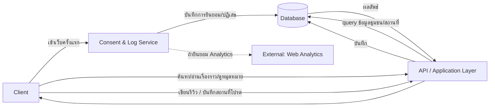
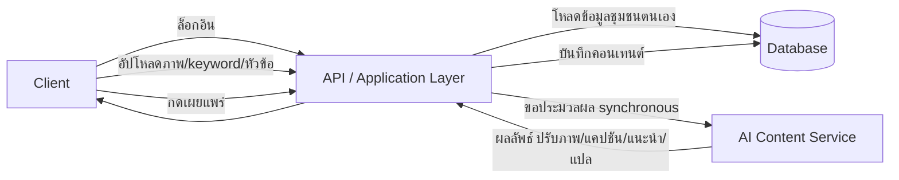
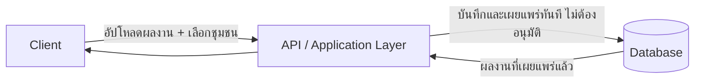
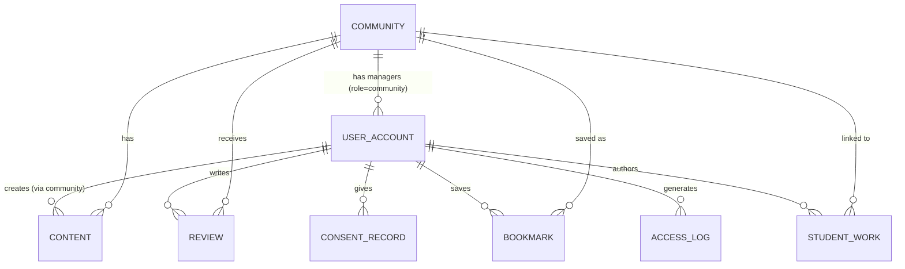

# High-Level Design (Conceptual) — ภาพรวมระบบ

- **สถานะ**: Draft — conceptual เท่านั้น ยังไม่ผูกมัดกับ technical stack (framework/ภาษา/ยี่ห้อฐานข้อมูล/cloud) ใด ๆ
- **อ้างอิงจาก**: [[../../01-requirements/01-spec/local-story-hub|local-story-hub]], [[../../01-requirements/01-spec/20260822-01-it-log-pdpa-consent|20260822-01-it-log-pdpa-consent]], [[../../01-requirements/03-task/feature-list|feature-list]], [[../01-prototypes/tourist-journey|tourist-journey]], [[../01-prototypes/community-content-journey|community-content-journey]], [[../01-prototypes/student-content-journey|student-content-journey]]
- **ดู Detailed Design (Sequence Flow) ที่ต่อยอดจากไฟล์นี้**: [[detailed-design|detailed-design]]

> **ไฟล์นี้คือภาพรวมระบบไฟล์เดียว** — รวม High-Level Architecture, Database Schema (ER Diagram + entity), และ API Spec ไว้ด้วยกัน เพื่อให้เรียกใช้งานง่าย ไม่ต้องเปิดหลายไฟล์ (ตามที่ผู้ใช้ขอ 2026-08-28) — รายละเอียดระดับ sequence/interaction แยกไว้ที่ [[detailed-design|detailed-design]] เพราะเป็นรายละเอียดที่ลึกกว่าระดับภาพรวม

## Context

เอกสารนี้อธิบาย Local Story Hub ในระดับแนวคิด — component มีอะไรบ้าง, ข้อมูลไหลอย่างไร, เก็บข้อมูลอะไรบ้าง, และมี API operation อะไรบ้าง ไม่ใช่วิธี implement จริง เพราะยังมี Open Question สำคัญ (เช่น แพลตฟอร์ม Website/Application) ที่ยังไม่ปิด จึงตั้งใจให้ทุกส่วนอธิบายด้วยหน้าที่/แนวคิด ไม่ใช่ชื่อเทคโนโลยี เพื่อให้เอกสารนี้ยังใช้ได้ไม่ว่าจะเลือก stack ใดในภายหลัง

## Component หลัก

| Component | หน้าที่ |
|---|---|
| **Client** | ส่วนติดต่อผู้ใช้ทั้ง 3 กลุ่ม (ชุมชน, นักท่องเที่ยว, นิสิต) — เป็น Website และ/หรือ Application (ยังเป็น Open Question — ดูหัวข้อ Open Items) สไตล์/component ตาม [[../01-prototypes/DESIGN|DESIGN.md]] |
| **API / Application Layer** | รับคำขอจาก Client, ควบคุม business logic และสิทธิ์การเข้าถึง, ประสานงานกับ component อื่นทั้งหมด — เป็นจุดเดียวที่ Client คุยด้วยโดยตรง |
| **AI Content Service** | ปรับภาพ (FR-1.1), คิดแคปชัน (FR-1.2), แปลภาษา (FR-1.3), แนะนำ SEO (FR-1.4), แนะนำวิธีเล่าเรื่อง (FR-1.5) — ทำงานแบบ **Synchronous** (ดู Decision Log) |
| **Consent & Log Service** | แสดง/บันทึก Consent (BL-015, BL-016), บันทึก access log ของผู้ใช้งานทุกคนอย่างน้อย 90 วัน (BL-014), เก็บหลักฐาน consent (BL-017) |
| **Database** | เก็บข้อมูลหลักของระบบทั้งหมด — ดูรายละเอียด entity ในหัวข้อ "Database Schema" ด้านล่าง |
| **External: Web Analytics** | เชื่อมต่อ Google Analytics เฉพาะเมื่อผู้ใช้ยินยอม (ผูกกับ Consent & Log Service) |

## Data Flow ตาม User Journey

### นักท่องเที่ยว — [[../01-prototypes/tourist-journey|tourist-journey]]

อ้างอิง: FR-2.1–2.5 ([[../../01-requirements/01-spec/local-story-hub|local-story-hub]]), FR-2/FR-3 ([[../../01-requirements/01-spec/20260822-01-it-log-pdpa-consent|20260822-01-it-log-pdpa-consent]])

### ชุมชน — [[../01-prototypes/community-content-journey|community-content-journey]]

อ้างอิง: FR-1.1–1.7 ([[../../01-requirements/01-spec/local-story-hub|local-story-hub]])

### นิสิตนิเทศศาสตร์ — [[../01-prototypes/student-content-journey|student-content-journey]]

อ้างอิง: FR-3.1 ([[../../01-requirements/01-spec/local-story-hub|local-story-hub]]) — การอนุมัติก่อนเผยแพร่ถูกตอบแล้วว่าไม่ต้องมี (ดู Business Rules ในสเปค)

## Database Schema

### ภาพรวม ER Diagram

### UserAccount

บัญชีผู้ใช้แบบเดียวสำหรับทั้ง 3 กลุ่ม แยกด้วย `role` — รวม entity เพื่อลดความซ้ำซ้อน (ดู Decision Log)

| Field | ประเภท | บังคับ | คำอธิบาย |
|---|---|---|---|
| id | รหัสอ้างอิง | ใช่ | |
| role | ตัวเลือก (community / tourist / student) | ใช่ | กำหนดสิทธิ์และหน้าที่ |
| community_id | อ้างอิงไปยัง Community | เฉพาะ role=community | บัญชีนี้เป็นผู้จัดการชุมชนไหน — รายละเอียดสิทธิ์ยังเป็น Open Question |
| display_name | ข้อความ | ใช่ | |
| email / credential | ข้อความ | ใช่ | ใช้สำหรับ login — วิธีจริง (email/password, OAuth ฯลฯ) เป็นเรื่อง technical stack ไม่ระบุที่นี่ |
| created_at | วันที่-เวลา | ใช่ | |

### Community

| Field | ประเภท | บังคับ | คำอธิบาย |
|---|---|---|---|
| id | รหัสอ้างอิง | ใช่ | |
| name | ข้อความ | ใช่ | ชื่อชุมชน |
| description | ข้อความ | ไม่ | |
| province | ข้อความ | ไม่ | |
| created_at | วันที่-เวลา | ใช่ | |

### Content

เรื่องราว/คอนเทนต์ของชุมชน (FR-1.1–1.5)

| Field | ประเภท | บังคับ | คำอธิบาย |
|---|---|---|---|
| id | รหัสอ้างอิง | ใช่ | |
| community_id | อ้างอิงไปยัง Community | ใช่ | |
| title | ข้อความ | ใช่ | |
| body_th | ข้อความยาว | ใช่ | เนื้อหาต้นฉบับภาษาไทย |
| body_en | ข้อความยาว | ไม่ | ผลลัพธ์จากการแปลด้วย AI (FR-1.3) — รูปแบบ (ข้อความ/เสียงพากย์) ยังเป็น Open Question |
| image_original_ref | อ้างอิงไฟล์ | ไม่ | |
| image_enhanced_ref | อ้างอิงไฟล์ | ไม่ | ผลลัพธ์จาก AI ปรับภาพ (FR-1.1) |
| caption | ข้อความ | ไม่ | จาก AI (FR-1.2) |
| seo_keywords | รายการข้อความ | ไม่ | จาก AI (FR-1.4) — เชื่อม search engine จริงหรือแนะนำภายในระบบยังเป็น Open Question |
| status | ตัวเลือก (draft / published) | ใช่ | |
| created_at / updated_at | วันที่-เวลา | ใช่ | |

### Review

รีวิวจากนักท่องเที่ยว (FR-2.4) — **ต้องมี UserAccount role=tourist** ตาม Decision Log

| Field | ประเภท | บังคับ | คำอธิบาย |
|---|---|---|---|
| id | รหัสอ้างอิง | ใช่ | |
| community_id | อ้างอิงไปยัง Community | ใช่ | |
| user_account_id | อ้างอิงไปยัง UserAccount (role=tourist) | ใช่ | |
| text | ข้อความ | ใช่ | |
| created_at | วันที่-เวลา | ใช่ | |

### Bookmark

สถานที่โปรดที่นักท่องเที่ยวบันทึกไว้ (FR-2.5) — ต้องมี UserAccount role=tourist

| Field | ประเภท | บังคับ | คำอธิบาย |
|---|---|---|---|
| id | รหัสอ้างอิง | ใช่ | |
| user_account_id | อ้างอิงไปยัง UserAccount (role=tourist) | ใช่ | |
| community_id | อ้างอิงไปยัง Community | ใช่ | |
| created_at | วันที่-เวลา | ใช่ | |

### StudentWork

ผลงานของนิสิตนิเทศศาสตร์ (FR-3.1)

| Field | ประเภท | บังคับ | คำอธิบาย |
|---|---|---|---|
| id | รหัสอ้างอิง | ใช่ | |
| user_account_id | อ้างอิงไปยัง UserAccount (role=student) | ใช่ | |
| community_id | อ้างอิงไปยัง Community | ใช่ | วิธีเชื่อมโยงผลงานกับชุมชนยังเป็น Open Question — ที่นี่จำลองเป็นการเลือกชุมชนตรง ๆ ตาม prototype-v1 |
| title | ข้อความ | ใช่ | |
| description | ข้อความ | ไม่ | |
| media_ref | อ้างอิงไฟล์ | ไม่ | |
| status | ตัวเลือก (published เท่านั้น) | ใช่ | เผยแพร่ทันทีเสมอ ไม่มีสถานะรออนุมัติ (Business Rule ที่ยืนยันแล้วใน local-story-hub.md) |
| created_at | วันที่-เวลา | ใช่ | |

### ConsentRecord

หลักฐานการให้ความยินยอม (BL-015, BL-016, BL-017)

| Field | ประเภท | บังคับ | คำอธิบาย |
|---|---|---|---|
| id | รหัสอ้างอิง | ใช่ | |
| user_account_id | อ้างอิงไปยัง UserAccount | ไม่ | Consent เกิดขึ้นได้ก่อน login (ผู้เข้าเว็บครั้งแรกยังไม่มีบัญชี) จึงเป็น field ไม่บังคับ |
| analytics_consent | จริง/เท็จ | ใช่ | |
| marketing_consent | จริง/เท็จ | ใช่ | ชื่อ field ชั่วคราว ครอบคลุม IP/tracking อื่นตามสเปค — รูปแบบ granular เต็มรูปแบบยังเป็น Open Question |
| timestamp | วันที่-เวลา | ใช่ | |

### AccessLog

บันทึกการเข้าใช้งานตามพ.ร.บ. คอมพิวเตอร์ (BL-014) — เก็บอย่างน้อย 90 วัน

| Field | ประเภท | บังคับ | คำอธิบาย |
|---|---|---|---|
| id | รหัสอ้างอิง | ใช่ | |
| timestamp | วันที่-เวลา | ใช่ | |
| ip_address | ข้อความ | ใช่ | |
| user_account_id | อ้างอิงไปยัง UserAccount | ไม่ | ผู้เข้าชมที่ยังไม่ login จะไม่มีค่านี้ |
| action | ข้อความ | ใช่ | |

> **หมายเหตุ**: field ของ AccessLog ยังไม่ครบถ้วนตามเจตนา — รายละเอียดที่ต้องเก็บ (user-agent ครบหรือไม่, ที่เก็บ, ผู้มีสิทธิ์เข้าถึง) ยังเป็น Open Question

## API Spec

รูปแบบ operation เชิงแนวคิด (ไม่ผูกมัดกับ REST/GraphQL หรือ framework ใด) — คอลัมน์ "อ้างอิง" คือ journey step / FR / BL ที่ทำให้เกิด operation นี้

### UserAccount

| Operation | Input | Output | อ้างอิง |
|---|---|---|---|
| สมัครบัญชี | role, display_name, email/credential | user_account | ผลจาก Decision Log (ยังไม่มี FR ต้นฉบับระบุตรง ๆ) |
| เข้าสู่ระบบ | email/credential | session/token (แนวคิด) | เช่นเดียวกับข้างต้น |

### Community / Content

| Operation | Input | Output | อ้างอิง |
|---|---|---|---|
| ค้นหา/แสดงรายการชุมชน | คำค้นหา (ไม่บังคับ) | รายการ community | FR-2.1, tourist-journey step 3 |
| ดูรายละเอียดชุมชน + เนื้อหา | community_id | community, content ที่เผยแพร่แล้ว | FR-2.2, FR-2.3 |
| ดูหน้าจัดการข้อมูลของชุมชนตนเอง | user_account (role=community) | รายการ content ของชุมชนนั้น | FR-1.6, community-content-journey step 1 |
| สร้างคอนเทนต์ฉบับร่าง | community_id, ข้อมูลเบื้องต้น | content (draft) | FR-1.6 |
| ให้ AI ปรับภาพ | content_id, image | image_enhanced_ref | FR-1.1 |
| ให้ AI คิดแคปชัน | content_id, keyword | caption | FR-1.2 |
| ให้ AI แนะนำวิธีเล่าเรื่อง | content_id, หัวข้อ | คำแนะนำ | FR-1.5 |
| ให้ AI แนะนำ SEO | content_id | seo_keywords | FR-1.4 |
| ให้ AI แปลภาษา | content_id | body_en | FR-1.3 |
| เผยแพร่คอนเทนต์ | content_id | content (status=published) | FR-1.6/1.7 |

### Review / Bookmark

| Operation | Input | Output | อ้างอิง |
|---|---|---|---|
| เขียนรีวิว | community_id, user_account (role=tourist), text | review | FR-2.4 |
| ดูรีวิวของชุมชน | community_id | รายการ review | FR-2.4 |
| บันทึก/ยกเลิกบันทึกสถานที่โปรด | community_id, user_account (role=tourist) | bookmark | FR-2.5 |
| ดูรายการสถานที่โปรดของตนเอง | user_account | รายการ bookmark | FR-2.5 |

### StudentWork

| Operation | Input | Output | อ้างอิง |
|---|---|---|---|
| อัปโหลด+เผยแพร่ผลงานทันที | user_account (role=student), community_id, ข้อมูลผลงาน | student_work (published) | FR-3.1, student-content-journey |
| ดูผลงานนิสิตที่เกี่ยวข้องกับชุมชน | community_id | รายการ student_work | FR-3.1 |

### Consent / Log

| Operation | Input | Output | อ้างอิง |
|---|---|---|---|
| แสดงข้อความ Consent ปัจจุบัน | — | นโยบายปัจจุบัน | BL-015 |
| บันทึกการยินยอม/ปฏิเสธ | analytics_consent, marketing_consent | consent_record | BL-015, BL-016, BL-017 |
| บันทึก access log | (อัตโนมัติทุกคำขอ ไม่มี public API) | access_log | BL-014 |

## ประเด็นข้ามระบบ (Cross-cutting concerns)

- **Consent & Logging** ต้องเกิดกับทุกคำขอที่ Client ส่งเข้ามา ไม่ใช่แค่หน้าแรก — แนวคิดคือ Consent & Log Service ทำงานคู่ขนานกับทุก request ผ่าน API layer
- **การเข้าถึงง่ายสำหรับผู้สูงอายุ** (FR-1.7) เป็นความรับผิดชอบของ Client ตาม [[../01-prototypes/DESIGN|DESIGN.md]] ไม่ใช่ประเด็นสถาปัตยกรรม backend
- **ขอบเขตของ "ระบบจัดการข้อมูลชุมชน"** (Open Question) จะกระทบรายละเอียดภายในของ API/Database layer แต่ไม่กระทบ component ระดับสูงที่ระบุไว้ในเอกสารนี้
- **Non-functional requirements** (performance, จำนวนผู้ใช้, ความปลอดภัย) ยังไม่ถูกระบุในสเปค — ออกแบบไว้สำหรับสเกลระดับชุมชน/มหาวิทยาลัย (ผู้ใช้พร้อมกันไม่มาก) ยังไม่ได้ optimize สำหรับ traffic สูง ควรทบทวนเมื่อมีข้อมูลเพิ่ม

## Decision Log

- **2026-08-28** — เลือกให้ AI Content Service ทำงานแบบ **Synchronous** (ผู้ใช้กดแล้วรอผลทันที) แทนการใช้คิว/asynchronous เหตุผล: สอดคล้องกับ [[../01-prototypes/prototype-v1/README|prototype-v1]] ที่ออกแบบปุ่ม AI เป็น synchronous ไว้แล้วทั้งหมด และขนาดงาน (ปรับภาพเดี่ยว, ข้อความสั้น) ยังไม่ถึงระดับที่จำเป็นต้องพึ่งคิว — ผู้ใช้ยืนยันตัวเลือกนี้เอง (มีอีก 2 ทางเลือกที่พิจารณาแล้วไม่เลือก: Asynchronous ผ่านคิว, Hybrid)
- **2026-08-28** — นักท่องเที่ยวต้องมีบัญชีผู้ใช้ (login เต็มรูปแบบ) จึงจะเขียนรีวิว/บันทึกสถานที่โปรดได้ (ผู้ใช้ยืนยันเอง หลังถูกถามพร้อม 3 ทางเลือก — ทางเลือกอื่นที่พิจารณาแล้วไม่เลือก: ไม่ต้องมีบัญชี/anonymous, Hybrid)
  > **ผลกระทบที่ต้องตามแก้**: [[../01-prototypes/prototype-v1/README|prototype-v1]] ปัจจุบันออกแบบฝั่งนักท่องเที่ยวแบบไม่มี login (ใช้ `localStorage` ต่ออุปกรณ์) — ไม่ตรงกับการตัดสินใจนี้อีกต่อไป ต้องอัปเดต prototype (เพิ่มหน้า login/register) และอาจกระทบ [[../../03-testing/01-test-plan/test-plan|test-plan]] (TC-001–TC-008) ในภายหลัง ยังไม่ได้แก้ในรอบนี้
- **2026-08-28** — รวม UserAccount เป็น entity เดียว (มี field `role`) แทนการแยก 3 entity ตามกลุ่มผู้ใช้ เพื่อลดความซ้ำซ้อนของ schema — เป็นการเลือกรูปแบบ normalization ไม่ใช่การตัดสินใจเชิง requirement จึงไม่ได้ถามผู้ใช้ก่อน
- **2026-08-28** — รวม High-Level Architecture + Database Schema + API Spec เป็นไฟล์เดียว (ไฟล์นี้) ตามที่ผู้ใช้ขอ เพื่อให้เป็นภาพรวมระบบไฟล์เดียวเรียกใช้งานง่าย — เดิมเคยแยกเป็น `architecture.md` และ `data-api-spec.md`

## Open Items ที่กระทบเอกสารนี้

ดูรายละเอียดเต็มที่ [[../../01-requirements/03-task/open-questions|open-questions]] — ที่กระทบเอกสารนี้โดยตรง:

1. **แพลตฟอร์ม (Website/Application)** — กระทบรายละเอียดของ Client component (ยังออกแบบระดับ high-level ได้โดยไม่ต้องรู้คำตอบ)
2. **บทบาทผู้ใช้และสิทธิ์การเข้าถึงของแต่ละชุมชน** — กระทบว่า `UserAccount` (role=community) ควรมีกี่ระดับสิทธิ์
3. **ขอบเขตของ "ระบบจัดการข้อมูลชุมชน"** — กระทบรายละเอียดภายในของ API/Database layer และว่า Content entity ต้องมี field เพิ่มอะไรอีกหรือไม่
4. **Non-functional requirements** — กระทบการตัดสินใจเรื่อง scalability/security ในรายละเอียดของ Detailed Design ต่อไป
5. **รูปแบบ Consent (granular/เดียว)** — กระทบโครงสร้าง field ของ ConsentRecord
6. **รายละเอียด Log ที่ต้องเก็บ** — กระทบ field ของ AccessLog
7. **เชื่อมโยงผลงานนิสิตกับชุมชน** — ตอนนี้จำลองเป็น FK ตรง ๆ ตาม prototype-v1 อาจต้องปรับถ้าคำตอบจริงซับซ้อนกว่านี้
