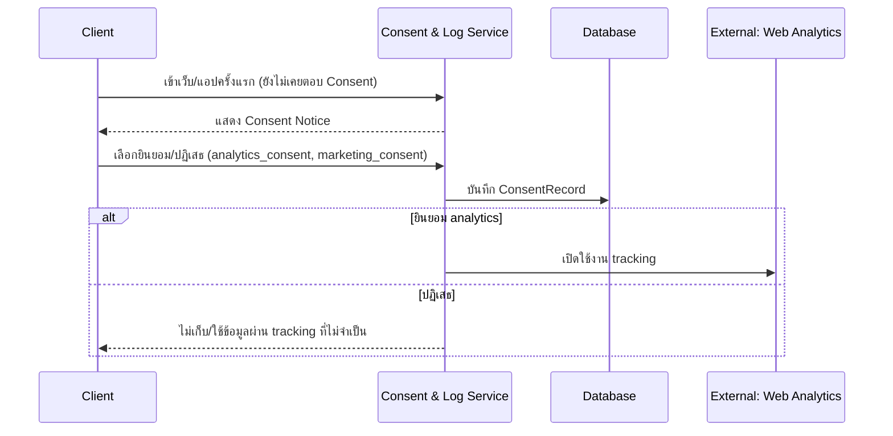
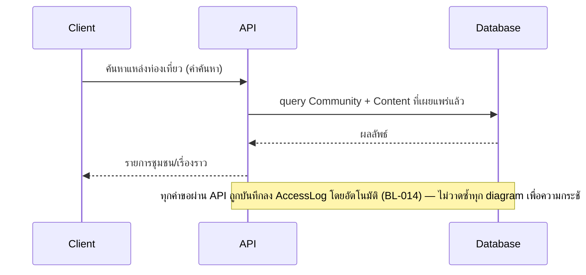
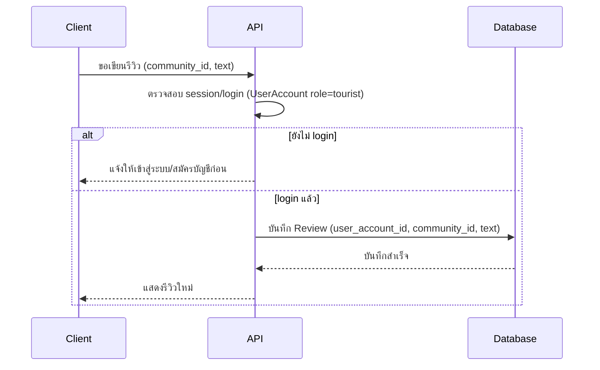
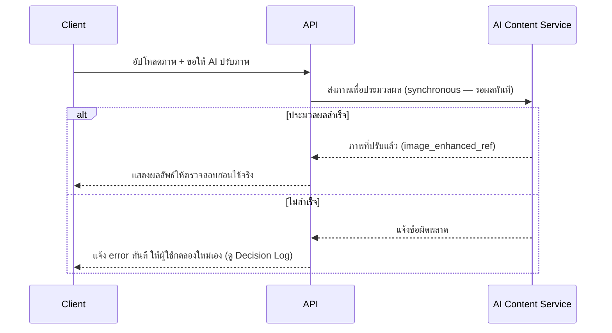
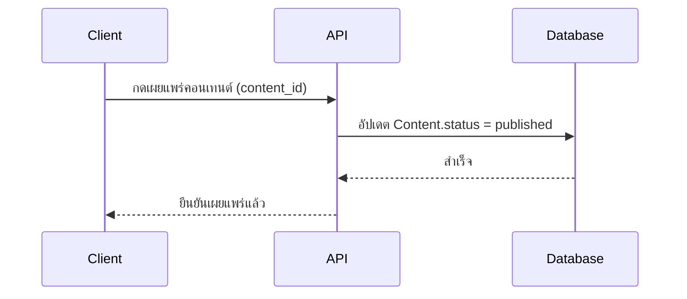
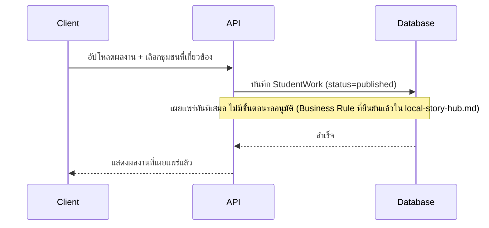

# Detailed Design (Conceptual)

- **สถานะ**: Draft — conceptual เท่านั้น ยังไม่ผูกมัดกับ technical stack ใด ๆ
- **อ้างอิงจาก**: [[architecture|architecture]], [[data-api-spec|data-api-spec]], [[../01-prototypes/tourist-journey|tourist-journey]], [[../01-prototypes/community-content-journey|community-content-journey]], [[../01-prototypes/student-content-journey|student-content-journey]]

## Decision Log

- **2026-08-28** — ถ้า AI Content Service ประมวลผลไม่สำเร็จ ระบบ**แจ้ง error ทันทีให้ผู้ใช้กดลองใหม่เอง** (ไม่มี retry อัตโนมัติ, ไม่ทำต่อเหมือนไม่มีอะไรเกิดขึ้น) — ผู้ใช้ยืนยันเอง หลังถูกถามพร้อม 3 ทางเลือก (อีก 2 ทางที่พิจารณาแล้วไม่เลือก: retry อัตโนมัติ 1-2 ครั้ง, ทำต่อเหมือนเดิมโดยไม่เตือน) เหตุผล: ง่ายที่สุด ตรงกับหลัก Synchronous ที่เลือกไว้ใน [[architecture|architecture]]

> **⚠️ ความไม่สอดคล้องที่ยังไม่ได้แก้**: Sequence "นักท่องเที่ยวเขียนรีวิว" ด้านล่างออกแบบตามการตัดสินใจใน [[data-api-spec|data-api-spec]] ว่านักท่องเที่ยวต้องมีบัญชี (login) แต่ [[../01-prototypes/tourist-journey|tourist-journey]] และ [[../01-prototypes/prototype-v1/README|prototype-v1]] ที่มีอยู่ยังออกแบบแบบไม่มี login (ใช้ `localStorage`) — ยังไม่ได้อัปเดตสองไฟล์นั้นให้ตรงกัน (บันทึกไว้ตั้งแต่รอบที่แล้วใน `05-log`)

## Sequence Flow

### 1. PDPA Consent (ผูกกับทุกครั้งที่เข้าเว็บครั้งแรก)

**อ้างอิง**: tourist-journey step 1–2 · FR-2, FR-3 ([[../../01-requirements/01-spec/20260822-01-it-log-pdpa-consent|20260822-01-it-log-pdpa-consent]]) · BL-015, BL-016 · API: "แสดงข้อความ Consent ปัจจุบัน", "บันทึกการยินยอม/ปฏิเสธ" ([[data-api-spec|data-api-spec]])

### 2. นักท่องเที่ยวค้นหาและอ่านเรื่องราวชุมชน

**อ้างอิง**: tourist-journey step 3–4 · FR-2.1, FR-2.2 · API: "ค้นหา/แสดงรายการชุมชน", "ดูรายละเอียดชุมชน + เนื้อหา" ([[data-api-spec|data-api-spec]])

### 3. นักท่องเที่ยวเขียนรีวิว (ต้อง login)

**อ้างอิง**: tourist-journey step 6 (DRAFT — journey เดิมไม่มีขั้นตอน login ดูคำเตือนด้านบน) · FR-2.4 · API: "เขียนรีวิว" ([[data-api-spec|data-api-spec]])

### 4. ชุมชนขอให้ AI ปรับภาพ (Synchronous)

**อ้างอิง**: community-content-journey step 2 · FR-1.1 · API: "ให้ AI ปรับภาพ" ([[data-api-spec|data-api-spec]]) — รูปแบบเดียวกันนี้ใช้กับ AI operation อื่นในหมวดเดียวกัน (คิดแคปชัน FR-1.2, แนะนำเรื่องเล่า FR-1.5, แนะนำ SEO FR-1.4, แปลภาษา FR-1.3) จึงไม่วาดซ้ำทุก operation

### 5. ชุมชนเผยแพร่คอนเทนต์

**อ้างอิง**: community-content-journey step 7 · FR-1.6, FR-1.7 · API: "เผยแพร่คอนเทนต์" ([[data-api-spec|data-api-spec]])

### 6. นิสิตเผยแพร่ผลงานทันที (ไม่ต้องอนุมัติ)

**อ้างอิง**: student-content-journey step 1–3 · FR-3.1 · API: "อัปโหลด+เผยแพร่ผลงานทันที" ([[data-api-spec|data-api-spec]])

## Open Items ที่กระทบเอกสารนี้

1. **ความไม่สอดคล้องเรื่อง login ของนักท่องเที่ยว** (ดูคำเตือนด้านบน) — ต้องอัปเดต journey + prototype ให้ตรงกับ sequence #3
2. **บทบาทผู้ใช้และสิทธิ์การเข้าถึงของแต่ละชุมชน** (Open Question เดิม) — อาจต้องเพิ่มขั้นตอนตรวจสิทธิ์ในหลาย sequence เมื่อคำตอบชัดเจนขึ้น
3. รายละเอียดเพิ่มเติมอื่น ๆ ดูที่ [[../../01-requirements/03-task/open-questions|open-questions]]
