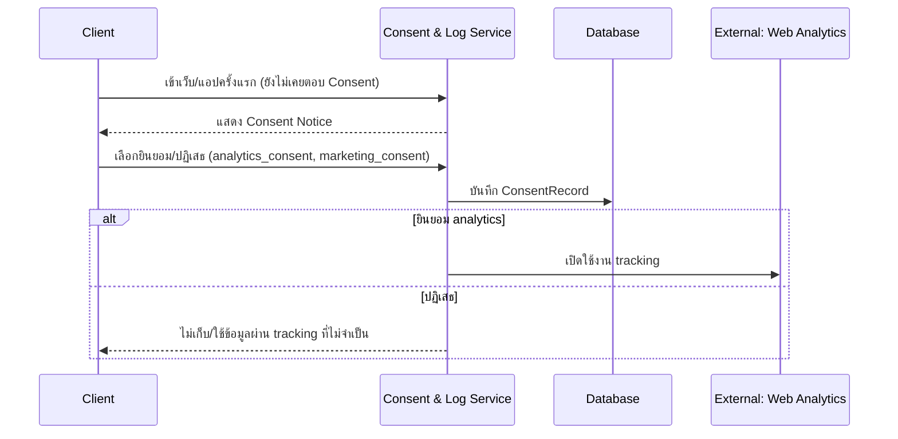
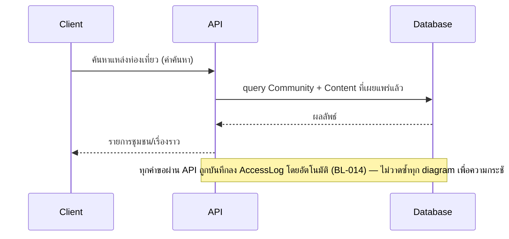
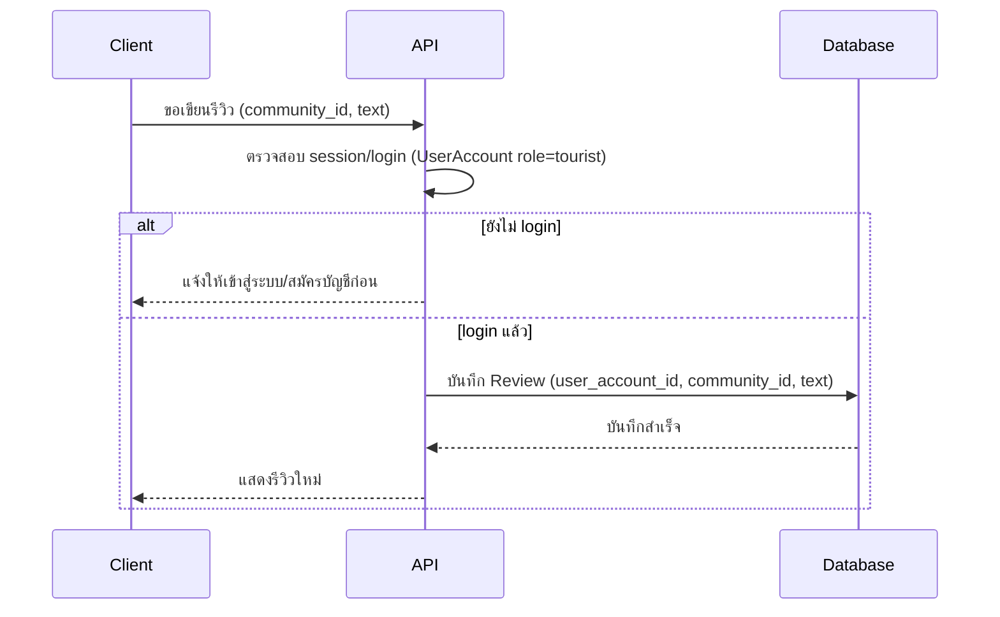
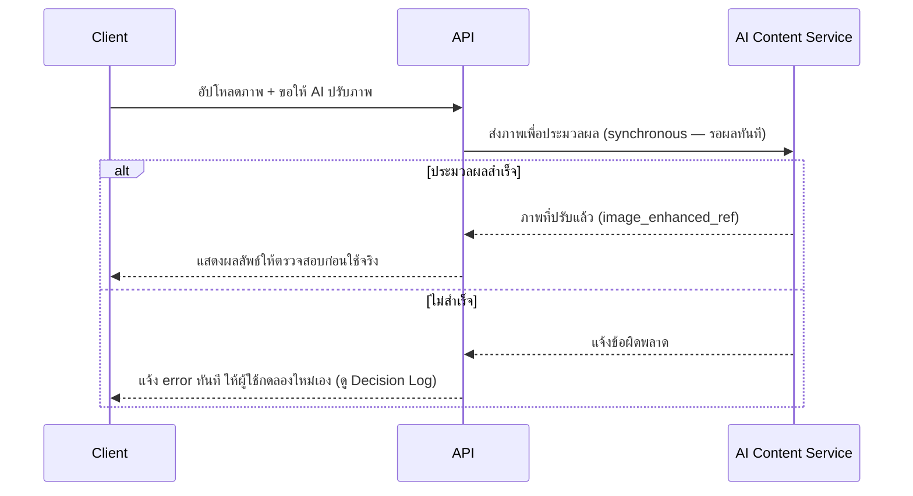
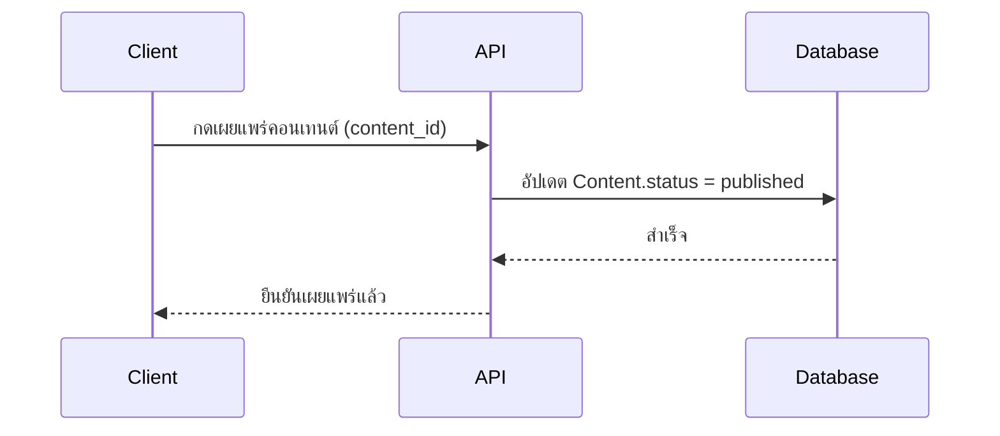
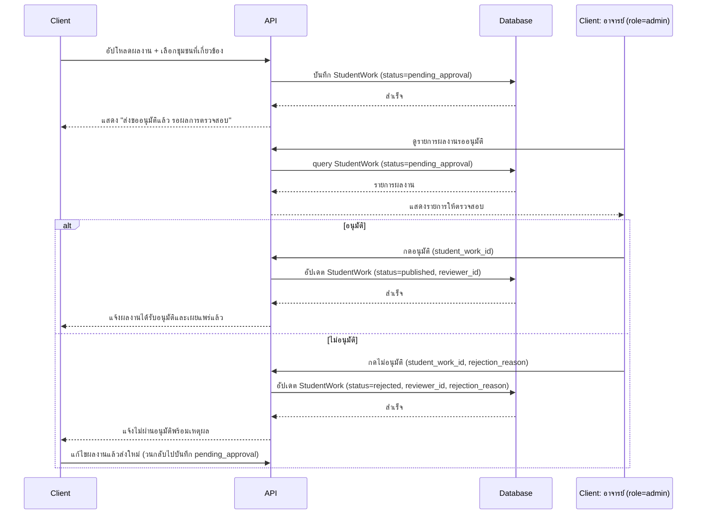
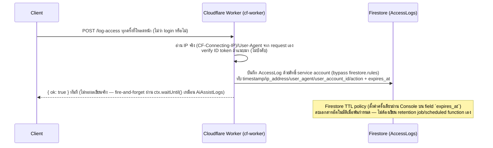
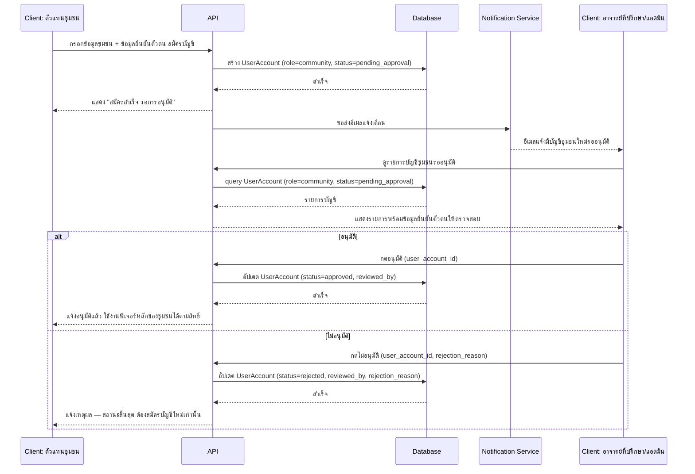
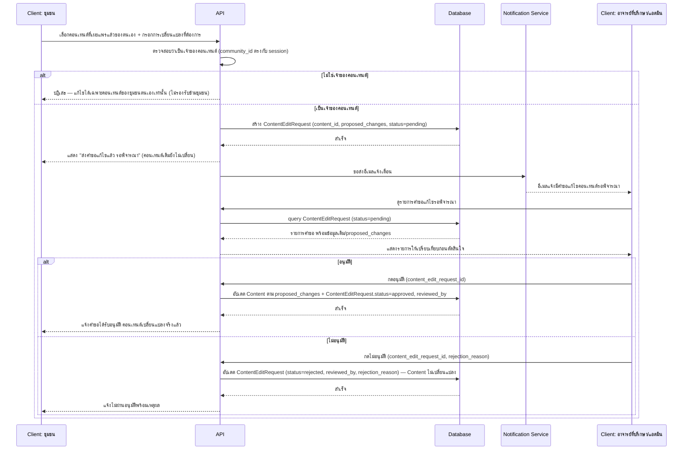

# Detailed Design (Conceptual)

- **สถานะ**: Draft — conceptual เท่านั้น ยังไม่ผูกมัดกับ technical stack ใด ๆ
- **อ้างอิงจาก**: [[architecture|architecture]] (รวม High-Level Architecture + Database Schema + API Spec ไว้ในไฟล์เดียว), [[../../01-requirements/01-spec/20260822-01-it-log-pdpa-consent|20260822-01-it-log-pdpa-consent]], [[../01-prototypes/tourist-journey|tourist-journey]], [[../01-prototypes/community-content-journey|community-content-journey]], [[../01-prototypes/student-content-journey|student-content-journey]], [[../01-prototypes/community-account-registration-journey|community-account-registration-journey]], [[../01-prototypes/community-content-edit-request-journey|community-content-edit-request-journey]]

## Decision Log

- **2026-08-28** — ถ้า AI Content Service ประมวลผลไม่สำเร็จ ระบบ**แจ้ง error ทันทีให้ผู้ใช้กดลองใหม่เอง** (ไม่มี retry อัตโนมัติ, ไม่ทำต่อเหมือนไม่มีอะไรเกิดขึ้น) — ผู้ใช้ยืนยันเอง หลังถูกถามพร้อม 3 ทางเลือก (อีก 2 ทางที่พิจารณาแล้วไม่เลือก: retry อัตโนมัติ 1-2 ครั้ง, ทำต่อเหมือนเดิมโดยไม่เตือน) เหตุผล: ง่ายที่สุด ตรงกับหลัก Synchronous ที่เลือกไว้ใน [[architecture|architecture]]
- **2026-09-04** — Sequence #6 (นิสิตเผยแพร่ผลงาน) ออกแบบใหม่ทั้งหมดตามการกลับคำตัดสินใจใน [[architecture|architecture]]: ต้องผ่านการอนุมัติจากอาจารย์ (role=admin) ก่อนเผยแพร่เสมอ — ไม่ใช่จุดตัดสินใจใหม่ที่ agent ต้องถามผู้ใช้ (ผู้ใช้แก้ Business Rule ในสเปคโดยตรงแล้ว) จึงปรับ sequence ให้ตรงกันทันที
- **2026-09-22** — แก้ความไม่สอดคล้องเรื่อง login ของนักท่องเที่ยว (ค้างมาตั้งแต่ 2026-08-28) ให้ตรงกับ Sequence #3 — เพิ่มหน้า `tourist-login.html` (สมัคร/login แบบจำลองด้วย localStorage เพราะนักท่องเที่ยวไม่มี backend จริง) เข้า [[../01-prototypes/prototype-v1/README|prototype-v1]], gate ปุ่ม "เขียนรีวิว"/"บันทึกสถานที่โปรด" ใน `tourist-story-detail.html` ให้เช็ค session ก่อนเสมอ (ยังไม่ login → พาไปหน้า login ก่อน), และอัปเดต [[../01-prototypes/tourist-journey|tourist-journey]] ให้มี step login คั่นก่อนสองการกระทำนี้ ทดสอบผ่าน browser จริงแล้วครบทุก flow (login, register, logout, redirect กลับ, bookmark/review หลัง login)
- **2026-09-23** — เพิ่ม Sequence #8 (สมัคร/อนุมัติบัญชีชุมชนใหม่ — BL-022) และ Sequence #9 (ชุมชนขอแก้ไขข้อมูล → อาจารย์/แอดมินอนุมัติ — BL-023) ปิดช่องว่างที่ระบุไว้ใน Open Items ข้อ 2 เดิม (มีแค่ Data Flow ระดับ high-level ใน [[architecture|architecture]] ยังไม่มี sequence ละเอียดระดับ component-to-component) ทั้งสอง sequence ออกแบบตามรูปแบบเดียวกับ Sequence #6 (นิสิตส่งผลงานขออนุมัติ) เพราะเป็น pattern "ส่งคำขอ → แจ้งเตือน → อาจารย์/แอดมินอนุมัติ/ไม่อนุมัติ" แบบเดียวกัน ไม่มีจุดที่ต้องถามผู้ใช้เพิ่มเพราะ Open Question ที่เกี่ยวข้องทั้งหมด (ข้อมูลยืนยันตัวตนชุมชน, การแก้ไขข้ามชุมชน) ปิดไปแล้วตั้งแต่ 2026-09-22
- **2026-09-23** — ปิดคำถามที่ค้างใน [[ACL|ACL]] § "คำถามที่ยังไม่มีคำตอบ" (ไม่ใช่ Open Question ของสเปค แต่เป็นรายละเอียดที่ไม่เคยมีที่มาจาก spec/backlog ใด) ถามผู้ใช้พร้อมเสนอ 3 ทางเลือกต่อข้อ ผู้ใช้เลือกทางเลือกที่แนะนำทั้ง 3 ข้อ (สอดคล้องกับ sequence ที่ออกแบบไว้แล้ว ไม่ต้องเพิ่ม state/API ใหม่): (1) นิสิตแก้ไข/ลบผลงานก่อนอาจารย์ตรวจสอบไม่ได้ ต้องรอผลอนุมัติ/ไม่อนุมัติก่อน (2) อาจารย์แก้ไขเนื้อหาผลงานแทนนิสิตไม่ได้ ทำได้แค่อนุมัติ/ไม่อนุมัติ (3) ชุมชนแก้ไข/ยกเลิกคำขอแก้ไขก่อนอาจารย์/แอดมินพิจารณาไม่ได้ ต้องรอผลก่อน — เพิ่มหมายเหตุใน Sequence #6 และ #9 ด้านบนยืนยันว่าไม่มี operation เหล่านี้โดยเจตนา

> ~~⚠️ ความไม่สอดคล้องที่ยังไม่ได้แก้~~ — **แก้ไขแล้ว 2026-09-22**: Sequence "นักท่องเที่ยวเขียนรีวิว" ด้านล่างออกแบบตามการตัดสินใจใน [[architecture|architecture]] ว่านักท่องเที่ยวต้องมีบัญชี (login) — อัปเดต [[../01-prototypes/tourist-journey|tourist-journey]] และ [[../01-prototypes/prototype-v1/README|prototype-v1]] ให้ตรงกันแล้ว (เพิ่ม `tourist-login.html`, gate ปุ่มเขียนรีวิว/บันทึกสถานที่หลัง session check)

## Sequence Flow

### 1. PDPA Consent (ผูกกับทุกครั้งที่เข้าเว็บครั้งแรก)

**อ้างอิง**: tourist-journey step 1–2 · FR-2, FR-3 ([[../../01-requirements/01-spec/20260822-01-it-log-pdpa-consent|20260822-01-it-log-pdpa-consent]]) · BL-015, BL-016, **BL-017** (ขั้น "ConsentLog->>DB: บันทึก ConsentRecord" ครอบคลุม BL-017 อยู่แล้ว — ConsentRecord มี field `timestamp` ตอบโจทย์ "เก็บวันเวลาที่ยินยอมไว้อ้างอิงได้ภายหลัง" ตรงตาม Acceptance Criteria พอดี ไม่ต้องออกแบบ sequence แยกใหม่ — เพิ่มหมายเหตุนี้ 2026-09-22 หลังตรวจสอบตามคำขอปิดช่องว่าง BL-017) · API: "แสดงข้อความ Consent ปัจจุบัน", "บันทึกการยินยอม/ปฏิเสธ" ([[architecture|architecture]])

### 2. นักท่องเที่ยวค้นหาและอ่านเรื่องราวชุมชน

**อ้างอิง**: tourist-journey step 3–4 · FR-2.1, FR-2.2 · API: "ค้นหา/แสดงรายการชุมชน", "ดูรายละเอียดชุมชน + เนื้อหา" ([[architecture|architecture]])

### 3. นักท่องเที่ยวเขียนรีวิว (ต้อง login)

**อ้างอิง**: tourist-journey step 6 (ตรงกับ journey แล้วตั้งแต่ 2026-09-22) · FR-2.4 · API: "เขียนรีวิว" ([[architecture|architecture]])

### 4. ชุมชนขอให้ AI ปรับภาพ (Synchronous)

**อ้างอิง**: community-content-journey step 2 · FR-1.1 · API: "ให้ AI ปรับภาพ" ([[architecture|architecture]]) — รูปแบบเดียวกันนี้ใช้กับ AI operation อื่นในหมวดเดียวกัน (คิดแคปชัน FR-1.2, แนะนำเรื่องเล่า FR-1.5, แนะนำ SEO FR-1.4, แปลภาษา FR-1.3) จึงไม่วาดซ้ำทุก operation

### 5. ชุมชนเผยแพร่คอนเทนต์

**อ้างอิง**: community-content-journey step 7 · FR-1.6, FR-1.7 · API: "เผยแพร่คอนเทนต์" ([[architecture|architecture]])

### 6. นิสิตส่งผลงานขออนุมัติ และอาจารย์อนุมัติ/ไม่อนุมัติ

> **แก้ไข 2026-09-04**: กลับคำตัดสินใจเดิม — sequence นี้เคยเป็น "เผยแพร่ทันทีไม่ต้องอนุมัติ" (ยืนยัน 2026-08-22) ผู้ใช้แก้ Business Rule ให้ต้องผ่านการอนุมัติจากอาจารย์ (role=admin) เสมอ จึงออกแบบใหม่ทั้งหมด

**อ้างอิง**: student-content-journey step 1–5 · FR-3.1, BL-018 · API: "อัปโหลดผลงาน + ส่งขออนุมัติ", "ดูรายการผลงานรออนุมัติ", "อนุมัติผลงาน", "ไม่อนุมัติผลงาน" ([[architecture|architecture]]) · จำนวนครั้งที่ส่งใหม่ได้ปิด Open Question แล้ว 2026-09-22 (ไม่จำกัดครั้ง) · **ปิดคำถามเพิ่มเติม 2026-09-23**: ไม่มี operation ให้นิสิตแก้ไข/ลบผลงานขณะสถานะ pending_approval โดยเจตนา (ต้องรอผลอนุมัติ/ไม่อนุมัติก่อนเสมอ) และไม่มี operation ให้อาจารย์แก้ไขเนื้อหาแทนนิสิต (ทำได้แค่อนุมัติ/ไม่อนุมัติ) — ดู [[ACL|ACL]]

### 7. บันทึก Access Log อัตโนมัติ + นโยบายเก็บรักษา 90 วัน (เพิ่ม 2026-09-22, implement จริง + ปรับ retention job → Firestore TTL 2026-09-23)

> เพิ่มเพื่อปิดช่องว่างที่พบใน [[../../03-testing/01-test-plan/test-plan|test-plan]] § "Backlog ที่ยังไม่มี Test Case" — เดิม Sequence #2 มีแค่ note บรรทัดเดียวว่าทุกคำขอถูกบันทึกลง AccessLog โดยไม่เคยออกแบบ retention/การลบเมื่อเกิน 90 วันเลยในเอกสารใดของโปรเจกต์

**เปลี่ยนจากแผนเดิม**: ตอนออกแบบครั้งแรก (2026-09-22) ยังไม่รู้ตัวเลือก technical stack เลยวาด loop
"retention job" ตรวจ/ลบเป็นรอบๆ ไว้แบบ generic — พอถึงตอน implement จริง (2026-09-23, Part 5) พบว่า
Firestore มีฟีเจอร์ TTL (Time-to-Live) ในตัวที่ทำงานแบบเดียวกันได้เลยโดยไม่ต้องเขียน scheduled
function เอง (และใช้ได้บนแผนฟรี Spark ไม่ต้องอัปเกรด Blaze) จึงตัดขั้นตอน "loop ตรวจสอบตามระยะเวลา"
ออกทั้งหมด แทนที่ด้วย TTL policy ของ Firestore เอง — รายละเอียดวิธีตั้งค่าอยู่ที่
`cf-worker/README.md` § "ตั้งค่า Firestore TTL policy"

**อ้างอิง**: BL-014 ([[../../01-requirements/01-spec/20260822-01-it-log-pdpa-consent|20260822-01-it-log-pdpa-consent]]) · API: "บันทึก access log" ([[architecture|architecture]]) · เป็นพฤติกรรม backend ล้วน ไม่มี step ใน User Journey ใดโดยตรง (เกิดกับทุกคำขอโดยอัตโนมัติ ไม่ใช่การกระทำที่ผู้ใช้ริเริ่มเอง) — field ที่ต้องเก็บและผู้มีสิทธิ์เข้าถึงปิด Open Question แล้ว 2026-09-22 (ครบ `user_agent`, เข้าถึงได้เฉพาะ Data Controller — ดู architecture.md § AccessLog) — implement จริงแล้ว 2026-09-23 ที่ `cf-worker/src/index.js` (`/log-access`) + หน้าดู log สั้นๆ ให้อาจารย์ที่ `admin-review-student-work.html` § Access Log

### 8. สมัคร/อนุมัติบัญชีชุมชนใหม่ (BL-022)

**อ้างอิง**: community-account-registration-journey step 1–6 · BL-022 · API: "สมัครบัญชี (ชุมชน)", "ดูรายการบัญชีชุมชนใหม่ที่รออนุมัติ", "อนุมัติบัญชีชุมชน", "ไม่อนุมัติบัญชีชุมชน" ([[architecture|architecture]]) · รูปแบบเดียวกับ Sequence #6 (นิสิต) — ต่างกันแค่ role และไม่มี resubmission (ไม่อนุมัติ = สถานะสิ้นสุด ต้องสมัครใหม่ ตรงตาม Business Rule ที่ปิดแล้ว 2026-09-22)

### 9. ชุมชนขอแก้ไขข้อมูล → อาจารย์/แอดมินอนุมัติ (BL-023)

**อ้างอิง**: community-content-edit-request-journey step 1–8 · BL-023 · API: "ส่งคำขอแก้ไขคอนเทนต์", "ดูรายการคำขอแก้ไขรอพิจารณา", "อนุมัติคำขอแก้ไข", "ไม่อนุมัติคำขอแก้ไข" ([[architecture|architecture]]) · entity `ContentEditRequest` ([[architecture|architecture]] § Database Schema) · การตรวจสอบความเป็นเจ้าของคอนเทนต์ (ไม่รองรับแก้ไขข้ามชุมชน) ปิด Open Question แล้ว 2026-09-22 · **ปิดคำถามเพิ่มเติม 2026-09-23**: ไม่มี operation ให้ชุมชนแก้ไข/ยกเลิก `ContentEditRequest` ขณะ status=pending โดยเจตนา (ต้องรอผลอนุมัติ/ไม่อนุมัติก่อนเสมอ) — ดู [[ACL|ACL]]

## Open Items ที่กระทบเอกสารนี้

1. ~~ความไม่สอดคล้องเรื่อง login ของนักท่องเที่ยว~~ — **ปิดแล้ว 2026-09-22**: อัปเดต journey + prototype-v1 ให้ตรงกับ sequence #3 แล้ว (เพิ่ม `tourist-login.html`, gate ปุ่มรีวิว/บันทึกสถานที่หลัง session check)
2. ~~บทบาทผู้ใช้และสิทธิ์การเข้าถึงของแต่ละชุมชน (Open Question เดิม)~~ — **ปิดแล้ว 2026-09-22**: ข้อมูลชุมชนใช้ร่วมกันได้ (shared, ไม่ isolate เต็มรูปแบบ) แต่การแก้ไขต้องผ่านอนุมัติ ดู sequence ที่เกี่ยวข้องใน [[architecture|architecture]] § Data Flow ("สมัคร/อนุมัติบัญชีชุมชนใหม่", "ชุมชนขอแก้ไขข้อมูล → อนุมัติ") — **sequence diagram ละเอียดสำหรับ 2 flow นี้เพิ่มแล้ว 2026-09-23**: Sequence #8 (สมัคร/อนุมัติบัญชีชุมชนใหม่) และ Sequence #9 (ชุมชนขอแก้ไขข้อมูล → อนุมัติ) ด้านบน — ปิดครบทั้งช่องว่างด้าน Open Question และด้าน sequence diagram แล้ว
3. **BL-014, BL-017 ปิดช่องว่างแล้ว 2026-09-22** — เพิ่ม Sequence #7 (Access Log + retention 90 วัน) และยืนยันว่า Sequence #1 ครอบคลุม BL-017 อยู่แล้ว (ดูหมายเหตุใน Sequence #1) — ทั้งสองยังเป็นพฤติกรรม backend ที่ไม่มี step ใน User Journey ใดโดยตรง (BL-014 เป็นไปโดยอัตโนมัติทุกคำขอ ไม่ใช่การกระทำที่ผู้ใช้ริเริ่ม) จึงยังไม่มี test case แบบ journey-based ใน [[../../03-testing/01-test-plan/test-plan|test-plan]] — ควรพิจารณาเพิ่ม test case แบบ backend/integration test แยกต่างหาก (ไม่ผูกกับ journey) เมื่อเริ่มมีโค้ดจริงให้ทดสอบ
4. รายละเอียดเพิ่มเติมอื่น ๆ ดูที่ [[../../01-requirements/03-task/open-questions|open-questions]]
