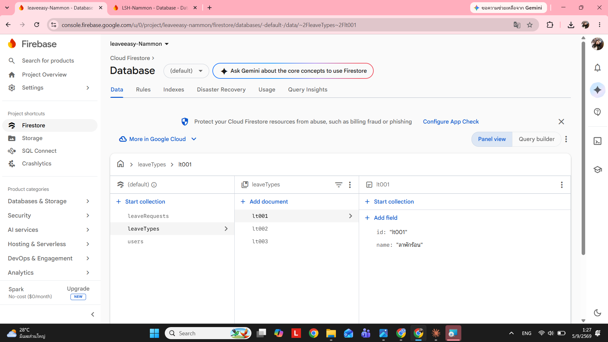

# Firestore Structure — leaveeasy-Nammon

บันทึกโครงสร้างข้อมูลปัจจุบันของ Firestore project `leaveeasy-Nammon` (ระบบลาออนไลน์) จากภาพหน้าจอ Firebase Console

## Collections

- **`leaveRequests`** — คำขอลาของผู้ใช้
- **`leaveTypes`** — ประเภทการลา เช่น
  - `lt001` — name: "ลาพักร้อน"
  - `lt002`
  - `lt003`
- **`users`** — ข้อมูลผู้ใช้ระบบ
